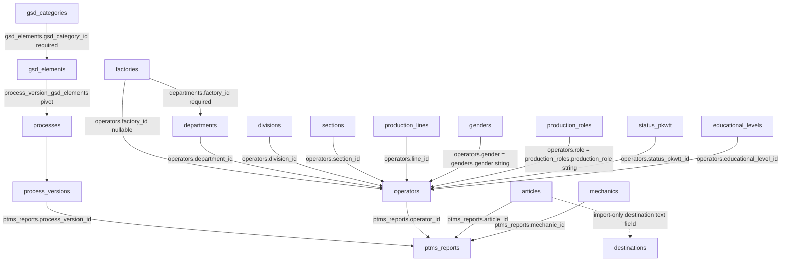

# Data Master Area — Comprehensive Audit Report
## Laravel (`localhost:8000`) → Next.js (`localhost:3000`) Functional Replication Spec

> **Scope of this document.** Read-only audit of the **Data Master area only** of the Laravel
> application (`kinglean2`, Laravel 10, Blade + inline `routes/web.php` closures), produced as the
> required first deliverable before any Next.js Data Master code is written. Every string, label,
> message, and behavior recorded here is transcribed **verbatim** from the Laravel source and live
> database so that the Next.js replica can be exact. Out-of-scope areas (Line Balancing,
> Operational Breakdown, Cycle Time, Kaizen, OSCP, Skill Matrix, TPM, VSM, Reports, Dashboard) are
> documented only where the Data Master area depends on them.
>
> **File-naming note:** this report is intentionally NOT named `auditkinglean2.md` (that file must
> never be recreated).

---

## 1. Audit Metadata

| Field | Value |
|---|---|
| Audit date | 2025-06 (current session) |
| Audit method | Static source read (Blade views, `routes/web.php`, models, migrations) + read-only SQL `SELECT`/`SHOW` against `lean_ie` + live sidebar/role inspection |
| Source app | Laravel 10, PHP 8.1, XAMPP, `d:\xampp\htdocs\kinglean2`, served at `http://localhost:8000` |
| Target app | Next.js 14.2.15 App Router (`lems-frontend/`), served at `http://localhost:3000` |
| Database | MySQL `lean_ie`, 127.0.0.1:3306, user `root`, no password |
| Data changes during audit | **None** (only `SHOW TABLES` and `SELECT COUNT(*)` were run) |
| Roles observed | `developer`, `admin`, `viewer` (table `roles`, `users.role_id`) |
| Locales | `resources/lang/en/master-data.php`, `resources/lang/id/master-data.php` (Blade UI mostly hardcodes English) |

---

## 2. Laravel Environment (Data-Master-relevant)

- **Two API surfaces exist and MUST NOT be confused:**
  1. `routes/api.php` + `app/Http/Controllers/Api/*Controller` — REST API for 15 entities, **hard
     delete** on destroy, paginated. This is what the current Next.js `/api/*` handlers mirror.
     **It is NOT the Data Master area.**
  2. `routes/web.php` (2,434 lines, **all inline closures**, no controllers) + Blade views under
     `resources/views/master-data/` — **this is the Data Master area** targeted by this audit.
     Semantics: **soft delete via `status` active/inactive**, bulk deactivate, separate hard-delete
     flows, `show_inactive`, `filter_column`/`filter_value`, `sort`/`direction`, Excel
     import/export, **no pagination** (`->get()`), `totalCount`.
- Route group (line 328): `Route::middleware('role:developer,admin,viewer')->prefix('master-data')->name('master-data.')`.
- `RoleMiddleware::handle()` (verbatim behavior): no user → `abort(401)`; role mismatch →
  `abort(403, 'You do not have permission to access this page. Please Change your account role to access this page. aowkwk ngakak')`.
  Registered as alias `'role'` in `app/Http/Kernel.php`.
- Helper `logActivity(string $activity, ?string $module)` writes `ActivityLog::create([user_id, username, activity, module])`.
- Excel: PhpSpreadsheet (`IOFactory::load()` for import; Xlsx writer for export), exports use
  `applyExcelFormatting()` = thin borders on used range + center/vertical-center align + auto-size
  columns; download headers `Content-Type: application/vnd.openxmlformats-officedocument.spreadsheetml.sheet`
  + `->deleteFileAfterSend(true)`; temp file `tempnam(sys_get_temp_dir(), 'export') . '.xlsx'`.
- Imports: `['file' => ['required','file','mimes:xlsx,xls,csv']]`, stored `->store('temp')` in
  `storage/app/temp`, header row normalized `array_map('strtolower', array_map('trim', $rows[0]))`,
  exact `array_search` per expected column, rows with blank name cell are skipped, `$imported++`
  counts **every processed row (create and update alike)**, temp file removed with `@unlink`.

---

## 3. Data Master Inventory

**22 masters** appear in the Data Masters sidebar (exact sidebar order):

| # | Sidebar label (en) | Slug / route prefix | DB table | Name field | View |
|---|---|---|---|---|---|
| 1 | Processes | `processes` | `processes` (+`process_versions`, pivot `process_version_gsd_elements`) | `process_name` | `processes.blade.php` (custom) |
| 2 | Employees | `operators` | `operators` | `operator_name` | `operators.blade.php` (custom) |
| 3 | Articles | `articles` | `articles` | `article_name` | `articles.blade.php` (custom) |
| 4 | GSD Elements | `gsd-elements` | `gsd_elements` | `element_name` | `gsd-elements.blade.php` (custom) |
| 5 | Factories | `factories` | `factories` | `factory_name` | `factories.blade.php` (custom) |
| 6 | Departments | `departments` | `departments` | `department_name` | `departments.blade.php` (custom) |
| 7 | Destinations | `destinations` | `destinations` | `destination` | `destinations.blade.php` (custom) |
| 8 | Production Lines | `production-lines` | `production_lines` | `line_name` | `production-lines.blade.php` (custom) |
| 9 | Skill Gradings | `skill-gradings` | `skill_gradings` | `skill_grade` | `simple-master.blade.php` |
| 10 | Divisions | `divisions` | `divisions` | `division` | `simple-master.blade.php` |
| 11 | Sections | `sections` | `sections` | `section` | `simple-master.blade.php` |
| 12 | Machine Types | `machine-types` | `machine_types` | `machine_type` | `simple-master.blade.php` |
| 13 | Components/Panels | `components-panels` | `components_panels` | `component_panel` | `simple-master.blade.php` |
| 14 | Machine Numbers | `machine-numbers` | `machine_numbers` | `machine_number` | `simple-master.blade.php` |
| 15 | Shifts | `shifts` | `shifts` | `shift` | `simple-master.blade.php` |
| 16 | Failure Modes | `failure-modes` | `failure_modes` | `failure_mode` | `simple-master.blade.php` |
| 17 | Mechanics | `mechanics` | `mechanics` | `mechanic` | `mechanics.blade.php` (custom) |
| 18 | Spare Parts | `spare-parts` | `spare_parts` | `spare_part` | `simple-master.blade.php` |
| 19 | Genders | `genders` | `genders` | `gender` | `simple-master.blade.php` |
| 20 | Production Roles | `production-roles` | `production_roles` | `production_role` | `simple-master.blade.php` |
| 21 | Educational Level | `educational-levels` | `educational_levels` | `level` | `simple-master.blade.php` |
| 22 | Status PKWTT | `status-pkwtt` | `status_pkwtt` | `pkwtt` | `simple-master.blade.php` |

**9 custom pages**: processes, operators (Employees), articles, gsd-elements, factories,
departments, mechanics, production-lines, destinations.
**13 simple masters** share `simple-master.blade.php` (identical UI, per-master display map).

**Reference tables used by masters but NOT Data Master pages** (exist as models/API only — the
current Next.js app wrongly shows them as top-level "Data Masters" pages):

| Table | Used as | Status vs prompt scope |
|---|---|---|
| `gsd_categories` | Category dropdown on GSD Elements create/edit; created on GSD import | **NOT FOUND IN CURRENT LARAVEL APPLICATION as a Data Master page** |
| `mtm_elements` | Line Balancing / Operational Breakdown lookups | **NOT a Data Master page** |
| `sewing_factors`, `sewing_stop_factors` | Line Balancing lookups | **NOT Data Master pages** |
| `ptms_reports` | Dependency guard source for operators/articles/mechanics/processes | Reports area (out of scope) |
| `process_versions`, `process_version_gsd_elements` | Child data of Processes | Managed inside Processes page |

---

## 4. Sidebar / Navigation (verbatim, `layouts/app.blade.php` lines 111–350)

Desktop sidebar sections (exact order and labels):

1. **Main** — `Home` (icon + `title="Home"` attr) with label `{{ __('master-data.dashboard') }}` →
   **`Dashboard`** (en) / `Dasbor` (id). Active state: `request()->routeIs('home', 'developer', 'admin', 'viewer')`.
   A second mobile nav hardcodes `<span>Home</span>`.
2. **Data Masters** (collapsible dropdown) — exact item order = table §3 rows 1–22
   (Processes, Employees, Articles, GSD Elements, Factories, Departments, Destinations,
   Production Lines, Skill Gradings, Divisions, Sections, Machine Types, Components/Panels,
   Machine Numbers, Shifts, Failure Modes, Mechanics, Spare Parts, Genders, Production Roles,
   Educational Level, Status PKWTT).
3. **Lean Operations** — Operational Breakdown, Line Balancing, Kaizen, Skills & OSCP, TPM, VSM,
   Employees Profile *(out of scope for redesign; keep pages reachable)*.
4. **Management** — `role_name` in `[developer, admin]`: **Credentials**; developer-only:
   **Clear Cache**, **Speed Test**, **Hard Delete**.
5. **System** (developer only) — Logs dropdown (Login Logs, Activity Logs), Settings.

Sidebar language selector uses keys `master-data.language` / `.english` / `.indonesian`.

Page `<title>` is static: `{{ config('app.name', 'LIMS') }}` (no per-page title). Every master page
uses `<x-app-layout><x-slot name="header">` with a single `<h2>` heading; no breadcrumbs.

---

## 5. Shared Data-Master UI Contract (the replication template)

Transcribed from `simple-master.blade.php` + the 9 custom views. Per-page deviations are captured
in §6/§7; anything not called out there follows this contract.

### 5.1 Page header
- Single `<h2 class="font-semibold text-lg text-slate-800 dark:text-slate-200 leading-tight">`.
- Content pattern: `Data Masters / {DisplayName}` (plain-text slash). Sources vary per page:
  hard-coded `Data Masters / …`, or `{{ __('master-data.data_masters') }} / …` (en → `Data Masters`,
  id → `Master Data`). No subtitle, no header buttons.

### 5.2 Flash banners (top of `max-w-7xl mx-auto space-y-6`)
- `session('success')` → emerald banner (`rounded-xl border border-emerald-200 … text-emerald-700`).
- `session('error')` → red banner. Raw strings, **no prefix label, no dismiss button**.

### 5.3 Row count (when present — see per-page table)
`Total Records: <span class="font-semibold">{{ $totalCount }}</span>` — placed after flash banners,
above the toolbar. `$totalCount` = count of the filtered collection.

### 5.4 Toolbar (left group, exact order)
1. **Search** `<input type="search" name="search">`, placeholder `Search {lowercase display name}...`
   (simple-master) or per-page fixed placeholder. Uppercase CSS transform on some pages (see §7).
   **No search icon.** Autocomplete dropdown beneath (fetched `GET /master-data/{slug}/search?q=`,
   300 ms debounce, min 1 char, rows `label` bold + optional `description` small truncated; click
   fills the box and submits; click-outside hides). **Form submits on Enter only.**
2. **Filter By** `<select>` first option **`Filter by...`** (value `""`), then ONE OR MORE exact
   column options (per-page, see §7). Changing it repopulates the value select but does NOT submit.
3. **Filter value** `<select name="filter_value">` first option **`All values`** (value `""`);
   options = distinct values of the chosen column (server-computed, `@json($filterValues)`); change
   **auto-submits**.
4. Hidden inputs: `filter_column`, `sort` (default = page default sort), `direction` (default `asc`).
5. **Show Inactive** checkbox `name="show_inactive" value="1"`, label **`Show Inactive`** (gsd-elements
   page says `Show inactive` — lowercase i!), `onchange="this.form.submit()"`.
6. **`Clear`** link → base index route.

### 5.5 Toolbar (right group, exact order)
`Import` → `Export` → `+ New` → `Delete`.
- **Import**: outlined slate, upload SVG, opens `#import-modal`. Role-gated (`!== 'viewer'`).
- **Export**: outlined slate anchor, download SVG, GET `.../export`. **NOT role-gated** (visible to all).
- **+ New**: filled `bg-indigo-600`, literal text `+ New` (no icon). Role-gated. Opens create modal.
- **Delete**: outlined red, trash SVG. Role-gated. Enters bulk delete mode.

### 5.6 Table
- Card `rounded-2xl border … bg-white`, `<table class="min-w-full divide-y … text-left text-sm">`.
- Columns (canonical order): *(hidden checkbox col)*, `No`, `{Name Header}`, `Descriptions`,
  `Status`, `Action` — per-page variations in §7.
- Sortable headers are links `request()->fullUrlWithQuery(['sort'=>…,'direction'=>toggle])`; active
  column shows `▲` (`&#9650;`) for asc / `▼` (`&#9660;`) for desc in `<span class="text-xs">`.
  `No` and action column never sortable. Default sort = name field, `asc` (persisted via hidden inputs).
- `No` cell = `{{ $index + 1 }}` (1-based over the entire unpaginated collection).
- Name cell `font-medium text-slate-900 dark:text-slate-100`; empty optional cells → `—` (em-dash).
- **Status pill**: `Active` = `bg-emerald-50 … text-emerald-700 ring-emerald-600/20`;
  `Inactive` = `bg-red-50 … text-red-700 ring-red-600/20`; keyed on `status === 'active'`.
- **Action**: single inline `Edit` text button (indigo) opening the edit modal — **no dropdown menu,
  no per-row deactivate, no per-row delete**. (Operators additionally has `Details` link →
  `/operators/{id}`, and its row `Edit` is viewer-gated; other pages' row Edit is not.)
- **No pagination anywhere** (`->get()`; no `->links()`, no "Showing X of Y").
- Empty state: single branch — per-page text like `No records found.` / `No factories found.` etc.
  with a `colspan` (sometimes wrong, preserved per-page). No loading/skeleton states anywhere.

### 5.7 Add/Edit modals
- Overlay `fixed inset-0 z-50 hidden bg-slate-900/40` (gsd-elements uses `bg-black/40` + click-to-close),
  panel `w-full max-w-lg rounded-2xl bg-white dark:bg-slate-800 p-6 shadow-xl`, header row with
  `<h3>` + close glyph `✕` (gsd-elements uses `&times;` → `×`).
- Separate `#create-modal` and `#edit-modal` per page (IDs vary). Titles `New {DisplayName}` /
  `Edit {DisplayName}` (per-page singular/plural — see §7).
- Canonical fields: name input (`required`, uppercase CSS, **no placeholder**, no `*` marker — gsd/mechanics
  use `*` in labels) + `description`/`Descriptions` textarea rows=2 (optional).
- Buttons: `Cancel` (outline) then `Save` (indigo) — gsd-elements uses `Create` / `Update`.
- Edit form action set by JS at runtime: `` form.action = `url('/master-data/{slug}')/${id}` ``,
  submitted as `POST + @method('PUT')`.
- **No validation-error UI anywhere** (HTML5 `required` only; server errors surface via Laravel
  redirect + `$errors` is never rendered).

### 5.8 Bulk delete ("Delete" mode) — the only destructive row flow in master pages
- `Delete` button unhides the checkbox column (`{page}-delete-col`), shows the red bulk bar, hides itself.
- Select-all checkbox in header; row checkboxes `name="ids[]"`.
- Bar: count text (variants: `N record(s) selected`, `Selected: N`) + buttons `Confirm Delete` +
  `Cancel`/`Cancel Delete` (per-page).
- `confirm*BulkDelete()` JS: 0 selected → `alert(...)` (per-page text); else native
  `confirm('…mark N … as inactive?')` (per-page phrase) → clone ids into hidden form →
  `POST + @method('PATCH')` to `.../bulk-deactivate`. **Despite the "Delete" naming this is SOFT
  deactivate** (`status='inactive'`).
- Server bulk result: `'{n} record(s) marked as inactive.'` (operators: `'{n} employee(s) marked as inactive.'`)
  or `error 'No records selected.'` when `ids` empty. Optional skip suffix for protected rows.

### 5.9 Import modal
- Title `Import {DisplayName}`; form `POST multipart` to `.../import`.
- Help text (two variants): bold `Expected Excel columns (row 1 = header):` + lowercase `<code>` chips
  (simple-master/factories/departments) OR footnote `Columns: …` (operators/processes/mechanics/
  articles/destinations/gsd/production-lines).
- File label `Excel File (.xlsx)` or `Excel File (.xlsx, .xls, .csv)`; input `name="file"
  accept=".xlsx,.xls,.csv" required`. Buttons `Cancel` / `Import`. **No template download.**

### 5.10 Export
Plain anchor GET `.../export` → xlsx download, active rows only, ordered by name column
(**exception: `production-lines` exports ALL rows** — see §6.8). Canonical columns
`No | {Name Header} | Descriptions` (per-master deviations §7). PhpSpreadsheet formatting via
`applyExcelFormatting()` = thin borders + center/center align + autoSize columns.

### 5.11 Autocomplete JSON (`GET /master-data/{slug}/search?q=`, active only, LIKE `%q%`, order name, limit 10)
- Empty `q` → `[]`. Shape `[{ id, label, description }]`. **Present on ALL 22 masters** (verified
  against web.php `search` closures — every page's search box has an autocomplete dropdown, 300ms
  debounce, click-to-fill + submit).
- Per-master shapes (match fields in parentheses):
  - simple-masters ×13 + factories: `label` = nameField/factory_name (`factory_name` only),
    `description = description ?? ''`.
  - destinations: match `destination` OR `description`; `label = destination`.
  - mechanics: match `nik_karyawan` OR `mechanic` (NOT description); `label = mechanic`,
    **`description` key carries the NIK** (`nik_karyawan ?? ''`).
  - operators: match `operator_name` OR `nik_karyawan`; `label = operator_name`,
    `description = nik_karyawan ?? ''`.
  - articles: match `article_name` OR `destination`; `label = article_name`,
    `description = destination ?? ''`.
  - processes: match `process_name` only; `label = process_name`, `description = description ?? ''`.
  - gsd-elements: match `element_name` OR `code` OR `motion_sequence`; `label = element_name`,
    `description = code + (motion_sequence ? ' — ' + motion_sequence : '')`.
  - departments: match `department_name` only; `label = department_name`,
    `description = desription ?? ''` (typo column).
  - production-lines: match `line_name` only; `label = line_name`, `description = description ?? ''`.

### 5.12 Role gating (verbatim pattern, every master page)
```blade
@if (auth()->user()->role->role_name !== 'viewer')
```
Wraps exactly: (1) the **Import** button; (2) the **`+ New`** and **`Delete`** buttons. And on
**operators only**, (3) the row **`Edit`** button. Export, search/filters, Show Inactive, sorting,
status pills, row Edit (other pages) are visible to all roles. Modals remain in the DOM for all roles.
Server-side viewer enforcement exists **only for operators** (`abort(403, 'Unauthorized. Viewer role is read-only.')`
on store/update/deactivate/bulk-deactivate/import). All other master write routes have no role check.

---

## 6. Backend Route Semantics (per master, verbatim)

All routes below are inside the `role:developer,admin,viewer` group `prefix('master-data')`.
Standard index params: `search`, `filter_column`, `filter_value`, `show_inactive`, `sort`,
`direction` (+ `date_from`, `date_to` for operators). Default sort = name field `asc`; invalid
`sort` falls back to name field, invalid `direction` → `asc`. Listings use `->get()`; the active
filter is `when(!$showInactive, fn($q) => $q->where('status','active'))`; `totalCount = count()`;
`filterValues` = distinct non-null plucks per filterable column. Store always creates with
`status => 'active'`. Update whitelists validated fields only. `deactivate` = single-row soft
delete. All validation messages are Laravel defaults.

### 6.1 Operators (`operators`) — Employees
- **Index** sortable: `operator_name, nik_karyawan, gender, role, start_date, date_of_birth, status, status_pkwtt, educational_level, factory, department, division, section, line`.
  Relation sorts via `leftJoin` + `select('operators.*')` with `$sortMap` (FK `line_id` for `line`, else `{$sort}_id`):
  `status_pkwtt→status_pkwtt.pkwtt`, `educational_level→educational_levels.level`, `factory→factories.factory_name`,
  `department→departments.department_name`, `division→divisions.division`, `section→sections.section`,
  `line→production_lines.line_name`.
  Eager loads: `statusPkwtt, educationalLevel, factory, department, division, section, productionLine`.
  Search LIKE: `operator_name, nik_karyawan, gender, role` + `orWhereHas` on the 7 relations' display columns.
  Filters (exact match, only when `filter_value !== ''`): 4 columns + 7 relation display columns;
  date ranges `date_from`/`date_to` on `start_date` / `date_of_birth` (only when that filter column is selected).
  `filterValues`: distinct plucks from `operators` (name/NIK/gender/role) + active-only masters
  (StatusPkwtt.pkwtt, EducationalLevel.level, Factory.factory_name, Department.department_name,
  Division.division, Section.section, ProductionLine.line_name). Also passes active option lists
  `genders, productionRoles, statusPkwttList, educationalLevels, factories, departments, divisions, sections, productionLines`.
- **Store** viewer guard. Validation:
  `operator_name required|string|max:100`; `nik_karyawan nullable|string|max:50|unique:operators,nik_karyawan`;
  `gender nullable|string|max:30`; `role nullable|string|max:100`;
  `photo nullable|file|image|mimes:jpg,jpeg,png|max:5120`; `status_pkwtt_id nullable|exists:status_pkwtt,id`;
  `educational_level_id nullable|exists:educational_levels,id`; `start_date nullable|date`;
  `date_of_birth nullable|date`; `factory_id nullable|exists:factories,id`; `department_id nullable|exists:departments,id`;
  `division_id nullable|exists:divisions,id`; `section_id nullable|exists:sections,id`; `line_id nullable|exists:production_lines,id`.
  **Auto field:** `employee_number = 'OP-' . strtoupper(Str::random(12))` (also regenerated on every import row!).
  Transforms: `operator_name` always `strtoupper`; `nik_karyawan`, `gender`, `role` `strtoupper` when non-empty.
  Photo → `photo_path = store('operators','public')`. Messages: `'Employee created successfully.'` /
  `'Employee updated successfully.'`; logs `'Created employee: {name}'` / `'Updated employee: {name}'` (module `'Employees'`).
- **Deactivate** viewer guard + **guard**: `ptmsReports()->exists()` → error
  `'This employee cannot be deactivated because historical reports reference the record.'`;
  else `'Employee deactivated successfully.'`.
- **Bulk-deactivate** viewer guard; protected ids = `PtmsReport::whereIn('operator_id',$ids)->pluck('operator_id')->unique()`;
  message `'{n} employee(s) marked as inactive.'` + `' {k} skipped (have historical reports).'` when protected.
- **Hard-delete** developer-only (`abort(403, 'Only developers can perform hard deletes.')`);
  eligible = `status='inactive'`; per-row guard `!ptmsReports()->exists()` + photo file deleted;
  `'{n} employee(s) permanently deleted.'` + `' {k} skipped (active or have dependencies).'`.
  (Quirk: `$skipped = count($ids) - count($toDelete)` only counts active rows; dep-blocked rows vanish from both counts.)
- **Import** viewer guard. Headers (lowercased): `operator name, nik karyawan, gender, role, status pkwtt, educational level, start date, date of birth, factory, department, division, section, line`.
  FK resolution by display name **active-only, silently null if missing** (StatusPkwtt.pkwtt,
  EducationalLevel.level, Factory.factory_name, Department.department_name, Division.division,
  Section.section, ProductionLine.line_name). Dates `Carbon::parse()->format('Y-m-d')` in try/catch → null.
  `updateOrInsert(['operator_name' => strtoupper($name)], [...])` — later rows with same name overwrite;
  blanks become `''` (not null); `status='active'`; `created_at` reset. Success `"Imported {$imported} employees."`.
- **Export** active only `orderBy('operator_name')`, 14 cols:
  `No | Employee Name | NIK Karyawan | Gender | Role | Factory | Department | Division | Section | Line | Status PKWTT | Educational Level | Start Date | Date of Birth`;
  filename **`employees.xlsx`**; dates `?->format('Y-m-d')`.
- **Search**: ✅ `[{id, label: operator_name, description: nik_karyawan ?? ''}]` (matches `operator_name` OR `nik_karyawan`).

### 6.2 Processes (`processes`)
- **Index** sortable `process_name, status`. Search LIKE `process_name`, versions' `version_number`,
  GSD `code`/`element_name`. Filters (exact): `process_name`, `version_number`, `gsd_code`.
  Eager: versions → gsdElements. `totalCount`. FilterValues: distinct `process_name` / `version_number` / GSD codes.
- **Store** validation: `process_name required|string|max:200`; `version_number nullable|integer|min:1`;
  `gsd_element_ids nullable|array`; `gsd_element_ids.* integer|distinct|exists:gsd_elements,id`.
  Creates Process (`description` null, `status='active'`) + one ProcessVersion
  (`version_number ?? 1`, `notes` null, `status='draft'`, `created_by => auth()->id()`) +
  `gsdElements()->sync(unique ids)`. Messages `'Process created successfully.'` / `'Process updated successfully.'`.
- **Update**: renames process, takes latest version (or creates), **overwrites its `version_number`**
  with submitted value, `gsd_element_ids` full re-sync.
- **Deactivate guard**: `versions()->whereHas('ptmsReports')` → error
  `'This process cannot be deactivated because it is used by historical reports.'`; else `'Process deactivated successfully.'`.
- **Bulk**: `'{n} record(s) marked as inactive.'` / `'No records selected.'`.
- **Hard-delete**: `'{n} process(es) permanently deleted.'` + `' {k} skipped (active or have dependencies).'`.
- **Import** headers `process name`, `version`; `firstOrCreate` semantics per name (creates Process +
  version). Success `"Imported {$imported} processes."`.
- **Export** cols `No | Process Name | Version | GSD Codes` — **one row per process-version**; GSD
  codes joined `", "` (table view joins with `" - "`); filename **`processes.xlsx`**.
- **Search**: ✅ `[{id, label: process_name, description: description ?? ''}]` (matches `process_name` only).

### 6.3 Articles (`articles`)
- **Index** sortable `article_name, status`. Search LIKE `article_name`. Filter `article_name` exact.
- **Store**: `article_name required|string|max:150`; `description nullable|string|max:255`;
  `photo nullable|file|image|mimes:jpg,jpeg,png|max:5120`.
  **Auto fields:** `label_number = 'LBL-' . strtoupper(Str::random(10))`; `label_number_quty = $labelNumber . '17596'`;
  `destination` created as `''`. Messages `'Article created successfully.'` / `'Article updated successfully.'`.
- **Update**: only `article_name`, `description`, `photo_path` (`?? $article->photo_path`) — label fields
  immutable. Old photo file deleted on replace.
- **Deactivate guard**: `ptmsReports()` → `'This article cannot be deactivated because historical reports reference the record.'`;
  else `'Article deactivated successfully.'`.
- **Bulk**: standard `'{n} record(s) marked as inactive.'` (NO ptmsReports protection — quirk).
- **Hard-delete**: inactive-only + `!ptmsReports()` per row + photo delete;
  `'{n} article(s) permanently deleted.'` + `' {k} skipped (active or have dependencies).'`.
- **Import** headers `article name, label number, destination, description` (singular!).
  Per-row **find-or-create** (not updateOrInsert): existing → update destination (if non-blank) /
  description (if non-null) / `status='active'` (**label preserved**); missing → create with
  `label_number` (blank → auto `LBL-…`), `label_number_quty = label . '17596'`. Success `"Imported {$imported} articles."`.
- **Export** only 2 cols: `No | Article Name`; filename **`articles.xlsx`** (round-trip cannot supply labels).
- **Search**: ✅ `[{id, label: article_name, description: destination ?? ''}]` (matches `article_name` OR `destination`).

### 6.4 GSD Elements (`gsd-elements`)
- **Index** sortable `element_name, description, code, tmu, seconds, motion_sequence, status`.
  Eager `gsdCategory`. Active filter column-qualified `gsd_elements.status`. Search LIKE
  `element_name, description, code, motion_sequence`. Filters exact: `element_name, code, motion_sequence`.
  Passes `$gsdCategories` (active, ordered `category_name`) for the form.
- **Store/Update**: `element_name required|string|max:200`; `description nullable|string|max:255`;
  `code required|string|max:50`; `tmu required|numeric|min:0`; `seconds required|numeric|min:0`;
  `motion_sequence nullable|string|max:100`; `gsd_category_id required|exists:gsd_categories,id`.
  Messages `'GSD Element created successfully.'` / `'GSD Element updated successfully.'`.
- **Deactivate**: no guard → `'GSD Element marked as inactive.'`.
- **Bulk**: standard `'{n} record(s) marked as inactive.'`.
- **Hard-delete**: inactive-only, **no dependency guard**; `'{n} GSD element(s) permanently deleted.'` +
  `' {k} skipped (active records cannot be hard deleted).'`.
- **Import** headers `element name, code, tmu, seconds, motion sequence, descriptions, category`.
  **Category FK: `GsdCategory::firstOrCreate(['category_name' => $cat], ['status'=>'active'])` —
  auto-creates missing categories**; blank → `gsd_category_id = null`. Non-numeric TMU/seconds → `0`.
  `updateOrInsert` on `element_name`. Success `"Imported {$imported} GSD elements."`.
- **Export** 8 cols `No | Element Name | Code | TMU | Seconds | Motion Sequence | Category | Descriptions`;
  filename **`gsd-elements.xlsx`**.
- **Search**: ✅ `[{id, label: element_name, description: code + (motion_sequence ? ' — ' + motion_sequence : '')}]` (matches `element_name` OR `code` OR `motion_sequence`).

### 6.5 Factories (`factories`)
- Sortable `factory_name, description, status`; search LIKE both; filter `factory_name` exact.
- **Store/Update**: `factory_name required|string|max:100`; `description nullable|string|max:255`.
  Messages `'Factory created successfully.'` / `'Factory updated successfully.'`.
- **Deactivate**: no guard → `'Factory marked as inactive.'`.
- **Bulk**: standard. **Hard-delete** dep guard `!departments()->exists()`; message uses
  `'{n} factory/factories permanently deleted.'` + `' {k} skipped (active or have dependencies).'`.
- **Import** headers `factory name, descriptions`; `updateOrInsert` on `factory_name`.
  Success `"Imported {$imported} factories."`.
- **Export** `No | Factory Name | Descriptions`; **`factories.xlsx`**.
  **Search**: ✅ `[{id, label: factory_name, description: description ?? ''}]` (matches `factory_name` only).

### 6.6 Departments (`departments`) — the `desription` typo is REAL
- Sortable `department_name, desription, status` (typo in sort key + model attribute!). Eager `factory`.
  Search LIKE `department_name, desription` + `orWhereHas factory.factory_name`. Filters exact:
  `department_name`, `factory_name` (via whereHas). `filterValues`: department names + **all**
  factory names (regardless of status — quirk). Passes active `$factories` for the form.
- **Store/Update**: `factory_id required|exists:factories,id`; `department_name required|string|max:100`;
  `desription nullable|string|max:255`. **The rendered blade has NO factory field — the create form
  cannot satisfy `required|factory_id` (known Laravel bug, preserve/flag).** Messages
  `'Department created successfully.'` / `'Department updated successfully.'`.
- **Deactivate**: no guard → `'Department marked as inactive.'`.
- **Bulk**: standard. **Hard-delete** dep guards `!operators()->exists() && !ptmsReports()->exists()`.
- **Import** headers `department name, descriptions, factory`; factory FK resolved active-only by
  name → silently null; writes `desription` column. Success `"Imported {$imported} departments."`.
- **Export** `No | Department Name | Descriptions` (values from `desription`); **`departments.xlsx`**.
  **Search**: ✅ `[{id, label: department_name, description: desription ?? ''}]` (matches `department_name` only).

### 6.7 Destinations (`destinations`)
- Sortable `destination, description, status`; search LIKE `destination, description`; filter
  `destination` exact.
- **Store/Update**: `destination required|string|max:100`; `description nullable|string|max:255`.
  Messages `'Destination created successfully.'` / `'Destination updated successfully.'`.
- **Deactivate**: no guard → `'Destination marked as inactive.'`.
- **Bulk**: standard `'{n} record(s) marked as inactive.'`.
- **Hard-delete**: inactive-only, **no dep guard**; `'{n} destination(s) permanently deleted.'` +
  `' {k} skipped (active records cannot be hard deleted).'`.
- **Import** headers `destination, descriptions`; `updateOrInsert`. Success `"Imported {$imported} destinations."`.
- **Export** `No | Destination | Descriptions`; **`destinations.xlsx`**.
- **Search**: ✅ `[{id, label: destination, description: description ?? ''}]` (matches `destination` OR `description`).

### 6.8 Production Lines (`production-lines`)
- Sortable `line_name, description, status`; search LIKE both; filter `line_name` exact.
- **Store/Update**: `line_name required|string|max:100`; `description nullable|string|max:255`.
  Messages `'Production line created successfully.'` / `'Production line updated successfully.'`.
  (Quirk: Prisma/DB has `division_id NOT NULL` but the Laravel store closure never supplies it —
  Laravel-side insert relies on a DB default; mirror Laravel's payload exactly.)
- **Deactivate** viewer-gate absent, **guard EXISTS**: `ptmsReports()->exists()` → error
  `'This production line cannot be deactivated because historical reports reference the record.'`;
  else `'Production line deactivated successfully.'` (NOT the generic 'marked as inactive').
- **Bulk**: standard `'{n} record(s) marked as inactive.'` (NO guard — quirk).
- **Hard-delete**: inactive-only + `!ptmsReports()` per-row guard; `'{n} production line(s) permanently deleted.'` +
  `' {k} skipped (active or have dependencies).'`.
- **Import** headers `line name, descriptions`; `updateOrInsert` on `line_name`.
  Success `"Imported {$imported} production lines."`.
- **Export** `No | Line Name | Descriptions`; **`production-lines.xlsx`** — **exports ALL rows
  regardless of status** (no `where('status','active')` — the ONLY export without the active filter).
  **Search**: ✅ `[{id, label: line_name, description: description ?? ''}]` (matches `line_name` only).

### 6.9 Mechanics (`mechanics`)
- Sortable `nik_karyawan, mechanic, description, status`; search LIKE the 3; filters exact
  `nik_karyawan`, `mechanic`. Variable named `$items`.
- **Store/Update**: `nik_karyawan nullable|string|max:50|unique:mechanics,nik_karyawan` (update: `,id`);
  `mechanic required|string|max:200`; `description nullable|string|max:255`.
  Messages `'Mechanic created successfully.'` / `'Mechanic updated successfully.'`.
- **Deactivate**: no guard → `'Record marked as inactive.'` (generic string!).
- **Bulk**: standard. **Hard-delete** dep guard `!ptmsReports()->exists()`; `'{n} mechanic(s) permanently deleted.'` + skip suffix.
- **Import** headers `nik karyawan, mechanic, descriptions`; blank NIK → `null`; `updateOrInsert` on `mechanic`.
  Success `"Imported {$imported} mechanics."`.
- **Export** `No | NIK KARYAWAN | Mechanic | Descriptions`; **`mechanics.xlsx`**.
- **Search**: ✅ `[{id, label: mechanic, description: nik_karyawan ?? ''}]` (matches NIK OR mechanic only — NOT description).

### 6.10 The 13 simple masters (shared `$simpleMasters` loop)
Config (verbatim): see §3 table rows 9–22 (slug / model / nameField). `importCols` in the PHP config
is **dead config** — import headers are computed as `str_replace('_',' ',$nameField)` + `'descriptions'`;
export header = `ucwords(str_replace('_',' ',$nameField))`.
- **Index** sortable `[nameField, description, status]`; search LIKE `nameField, description`; filter
  = `nameField` exact only; `totalCount`; filterValues distinct `nameField`.
- **Store/Update**: `nameField required|string|max:200`; `description nullable|string|max:255`.
  Success **`'{nameField} created successfully.'`** (raw field name! e.g. `'skill_grade created successfully.'`,
  `'pkwtt created successfully.'`) / `'{nameField} updated successfully.'`.
- **Deactivate**: no guard → **`'Record marked as inactive.'`**.
- **Bulk**: `'No records selected.'` / `'{n} record(s) marked as inactive.'`.
- **Hard-delete**: inactive-only, no dep guard → `'{n} record(s) permanently deleted.'` +
  `' {k} skipped (active records cannot be hard deleted).'`.
- **Import** headers computed as `str_replace('_',' ',$nameField)` + `descriptions` — the PHP
  `importCols` config (`component/panel`, `failure mode / kerusakan`) is **dead config and NOT what
  the importer matches**. Actual headers: `skill grade`, `division`, `section`, `machine type`,
  `component panel`, `machine number`, `shift`, `failure mode`, `spare part`, `gender`,
  `production role`, `level`, `pkwtt` (each + `descriptions`).
  `updateOrInsert` on nameField. Success **`"Imported {$imported} records."`** (generic!).
- **Export** `No | {ucwords nameField} | Descriptions`; filename **`{slug}.xlsx`** (e.g.
  `skill-gradings.xlsx`, `status-pkwtt.xlsx`). **No `logActivity` in simple-master export** (unique).
- **Search**: ✅ `[{id, label: item->{nameField}, description: item->description ?? ''}]`.

### 6.11 Centralized Hard Delete page (developer only)
- Routes `middleware('role:developer')`: `GET /hard-delete` (`hard-delete.index`) +
  `POST /hard-delete` + `@method('DELETE')` (`hard-delete.destroy`) with input `master_key`.
- 22 cards (display order, verified against web.php `$masters` array): Operators, Processes,
  Destinations, Articles, GSD Elements, Factories, Departments, Divisions, Sections, Production
  Lines, Mechanics, Failure Modes, Spare Parts, Machine Types, Machine Numbers, Skill Gradings,
  Components Panels, Shifts, Genders, Production Roles, Educational Levels, Status PKWTT —
  each with `Model::where('status','inactive')->count()`.
- Heading `Management / Hard Delete`; warning banner title `Danger Zone — Hard Delete` + body
  `This page permanently removes records from the database. This action **cannot be undone**. Only inactive (soft-deleted) records are shown below. This page is accessible only to the Developer role.`
- Card: label + `{count} inactive` badge (red when > 0); when count > 0 a form with button
  `Delete {count} Record(s)`; else `No inactive records to delete.`
- Native `confirm('Are you sure you want to permanently delete ALL {count} inactive {lowercase label} records? This cannot be undone.')`.
- Server messages: `'Invalid data master.'`; `'No inactive records to delete.'`;
  `"Permanently deleted {N} inactive record(s) from {key-with-spaces}."`;
  FK 23000 → `"Cannot delete inactive {label} — some records are still referenced by other data. Remove dependent records first."`;
  fallbacks `"Failed to delete inactive {label}: …"` / `"Failed to delete: …"`.

---

## 7. Per-Page UI Deviations Table (replicate literally!)

| Page | Header text source | Row count shown | Filter-By options | Search placeholder | Create/Edit submit labels | Bulk counter | Bulk cancel label | 0-selection alert | Confirm phrase | Action col header | Empty state text (colspan) | Import help format | Notes |
|---|---|---|---|---|---|---|---|---|---|---|---|---|---|
| simple-master ×13 | `Data Masters / {displayName}` (map) | ✅ `Total Records: N` | name col only | `Search {lc displayName}...` | `Save`/`Save` | `N record(s) selected` | `Cancel Delete` | `Please select at least one record to delete.` | `Are you sure you want to mark N record(s) as inactive?` | `Action` | `No records found.` (6) | bold `Expected Excel columns (row 1 = header):` + `code` chips | Modal titles `New {displayName}` / `Edit {displayName}` (plural incl. "New Skill Gradings"); name header = `ucwords(str_replace('_',' ',nameField))` (→ `Pkwtt`); description label `Descriptions` |
| factories | hardcoded | ❌ (not rendered) | `Factory Name` | `Search factories...` | `Save`/`Save` | `Selected: N` | `Cancel` | `No records selected.` | `Mark N factory(ies) as inactive?` | `Action` | `No factories found.` (6) | bold + chips (`factory name`, `descriptions`) | Modals `New Factory`/`Edit Factory`; uppercase on both fields; bulk form wraps table |
| departments | hardcoded | ❌ | `Department Name` | `Search departments...` | `Save`/`Save` | `N record(s) selected` | `Cancel Delete` | `No records selected.` | `Mark N department(s) as inactive?` | `Action` | `No departments found.` (6) | bold + chips | **`desription` typo everywhere**; desc textarea NOT uppercase; no factory field in UI |
| production-lines | `__('master-data.data_masters')` | ✅ | `Line Name` | `Search production lines...` | `Save`/`Save` | `N record(s) selected` | `Cancel` | `No records selected.` | `Mark N production line(s) as inactive?` | `Action` | `No production lines found.` (6) | footnote `Columns: Line Name, Descriptions`; label `Excel File (.xlsx)` | uppercase both fields; standalone bulk form |
| articles | `__()` both parts | ✅ | `Nama Article` | `Search articles...` | `Save`/`Save` | `N record(s) selected` | `Cancel` | `No records selected.` | `Mark N article(s) as inactive?` | `Action` | `No articles found.` (7 — wrong colspan) | footnote `Columns: Article Name` | Photo col (40px circle / initials fallback); modal labels `Nama Articles`, `Description`; edit has `Replace Photo` + 64px preview; `photo` accept `.jpg,.jpeg,.png` |
| gsd-elements | `__()` both parts | ❌ | `Element Name`, `Code`, `Motion Sequence` | `Search GSD elements...` | **`Create`/`Update`** | `N record(s) selected` | `Cancel Delete` | `No records selected.` | `Mark N GSD element(s) as inactive?` | `Action` | `No GSD elements found.` (10) | footnote `Columns: Element Name, Code, TMU, Seconds, Motion Sequence, Category, Descriptions` | **`Show inactive`** lowercase; modal `bg-black/40` click-close; close `×`; `*` markers in labels; Code as `<code>` chip; Category select `Select category`; TMU/Seconds `type=number step=0.01 min=0`; footer `Create`/`Update` |
| destinations | `__()` first part + literal `Destinations` | ✅ | `Destination` | `Search destinations...` | `Save`/`Save` | `N record(s) selected` | `Cancel` | `No records selected.` | `Mark N destination(s) as inactive?` | `Action` | `No destinations found.` (6) | footnote `Columns: Destination, Descriptions` | desc = textarea rows=2 uppercase; modals `New Destination`/`Edit Destination` |
| operators | `__()` + hard ` / Employees` | ✅ | 12 options (see §6.1) | `Search employees...` (uppercase CSS) | `Save`/`Save` | `N record(s) selected` | `Cancel` | **`Please select at least one record.`** | `Are you sure you want to mark N employee(s) as inactive?` | **`Actions`** | `No employees found.` (19) | footnote `Columns: Employee Name, NIK Karyawan, …` | 18-col table `min-w-[1200px]`; date-range pair with `to` separator; Details link + viewer-gated row Edit; `employee_number` auto `OP-…`; uppercase name/NIK/gender/role; edit preview 64px |
| processes | `__()` both parts | ❌ | `Process`, `Version`, `GSD Code` | `Search processes...` (no uppercase) | `Save`/`Save` | `N record(s) selected` | `Cancel Delete` | `No records selected.` | `Mark N process(es) as inactive?` | `Action` | `No process data found.` (7) | footnote `Columns: Process Name, Version` | Version pills `V{n}` (title = GSD name or `No GSD element`); GSD codes joined `" - "`; dynamic GSD select rows (`+ Add GSD Element`, `Remove`, `Select element`, options `code — element_name`); New version default `1` (nullable), Edit version `required`; row Edit NOT viewer-gated |
| mechanics | hardcoded | ❌ | `NIK KARYAWAN`, `Mechanic` | `Search mechanics...` (no uppercase) | `Save`/`Save` | **`Selected: N`** | `Cancel` | `No records selected.` | `Mark N mechanic(s) as inactive?` | **`Actions`** | `No mechanics found.` (7) | footnote `Columns: NIK KARYAWAN, Mechanic, Descriptions` | `Mechanic` label has red `*` marker; NIK placeholder `Optional`; all 3 inputs uppercase |

**Global quirk list (deliberate, preserve):**
1. `desription` typo (departments) — column, model attr, sort key, form field.
2. Bulk flow named "Delete"/"Confirm Delete" but performs **soft deactivate**.
3. `Total Records:` rendered on simple-master/production-lines/articles/destinations/operators only.
4. Show-inactive label: `Show Inactive` everywhere except gsd-elements (`Show inactive`).
5. Bulk counters/cancel labels/alerts/confirm phrases differ per page (table above).
6. Empty-state colspans sometimes wrong (articles 7, mechanics 7).
7. Export visible to `viewer`; Import/`+ New`/`Delete` hidden (UI-only except operators).
8. Row `Edit` viewer-gated on operators only.
9. Import always resets `status='active'` + `created_at`; operators regenerate `employee_number`.
10. Hard-delete `$skipped` undercounts (dep-blocked rows disappear from messages).
11. Simple-master success messages use raw field names (`skill_grade created successfully.`).
12. Simple-master export does not write an activity log.
13. Processes GSD join `" - "` in table vs `", "` in export.
14. No pagination, no loading states, no validation-error UI, no template downloads anywhere.
15. `<title>` static `LIMS` for every page.
16. `production-lines` export omits the `status='active'` filter (exports inactive rows too — only export that does).
17. `production-lines` deactivate has a ptmsReports guard and the success string `'Production line deactivated successfully.'` (deviates from the generic `'… marked as inactive.'`).
18. Simple-master import header matching uses computed `str_replace('_',' ',$nameField)` — NOT the `importCols` config values (`component/panel`, `failure mode / kerusakan` are dead config).
19. **`production-lines` create is broken in Laravel** — the INSERT omits the NOT NULL `division_id` column (added by `2026_09_18_000001_add_division_id_to_production_lines_table`, which also drops `department_id`) → every Add Production Line fails with MySQL 1452 and Laravel returns HTTP 500 `QueryException`. Verified error text: `Cannot add or update a child row: a foreign key constraint fails (lean_ie.production_lines, CONSTRAINT production_lines_division_id_foreign FOREIGN KEY (division_id) REFERENCES divisions (id) ON UPDATE CASCADE)`. Replicated verbatim: the replica endpoint returns 500 + `QueryException: {message}`.
20. **Dead guards** — the single-deactivate guard for departments calls `$dept->operators()` and for mechanics `$m->ptmsReports()`; neither relation exists on the model → `BadMethodCallException` → Laravel 500 *only when the guard would have had to block*. Since `ptms_reports` is empty these paths never fire today. **Policy applied**: the replica implements the INTENDED dependency check (`hasDependencies`) instead of crashing, and documents the divergence here.
21. **Departments create/update always fails silently** — store/update validate `factory_id: required|exists:factories,id` but the blade form omits `factory_id` entirely → every UI submission fails with `The factory id field is required.` — and because blades never render `$errors`, the failure is **silent** (the form appears to do nothing). Verified live. Replicated: same server rule kept, same silent-422 behavior (see §17.1).

---

## 8. Cross-Master Relationships (dependency documentation)



- Hard-delete dependency guards: factories→departments; departments→operators+ptms_reports;
  operators/articles/mechanics→ptms_reports; processes→(via versions)ptms_reports.
- Deactivate guards (single): operators, articles, processes (ptms_reports); everyone else unguarded.
- Operators form dropdowns are **flat/independent** (no cascading). Gender/Role store **strings**
  from the master tables' `gender`/`production_role` values (not FKs); Status PKWTT / Educational
  Level store FK ids.

---

## 9. Role Matrix (Data Master area)

| Capability | developer | admin | viewer | Enforcement |
|---|---|---|---|---|
| View pages / search / filter / sort / Show Inactive | ✔ | ✔ | ✔ | route group |
| Export (xlsx) | ✔ | ✔ | ✔ | none (ungated link) |
| Add (`+ New`) | ✔ | ✔ | hidden | UI-only (routes unguarded except operators) |
| Edit (row) | ✔ | ✔ | hidden **on operators only**; visible elsewhere | UI-only (operators: 403 server-side) |
| Deactivate (single `.../deactivate`) | ✔ | ✔ | routes reachable (UI hidden) | operators only 403 |
| Bulk deactivate | ✔ | ✔ | hidden (Delete button) | operators only 403 |
| Import | ✔ | ✔ | hidden | operators only 403 |
| Per-entity hard-delete route | ✔ | ✔ ⚠ | ✔ ⚠ | unguarded in web.php **except operators** (inline `developer` check → `Only developers can perform hard deletes.`); no blade links them |
| Hard Delete page (bulk per master) | ✔ | ✘ 403 | ✘ 403 | `role:developer` middleware |
| Credentials | ✔ | ✔ | ✘ 403 | `role:developer,admin` |
| Clear Cache / Speed Test / Logs / Settings | ✔ | ✘ | ✘ | developer-only sidebar entries |

---

## 10. Import/Export Comparison (all masters)

| Master | Import headers (lowercased keys) | Import strategy | Re-activates inactive? | Export columns | Filename |
|---|---|---|---|---|---|
| operators | `operator name, nik karyawan, gender, role, status pkwtt, educational level, start date, date of birth, factory, department, division, section, line` | updateOrInsert on upper name; FKs silent-null; dates Carbon-try | ✔ (+new `employee_number`, resets `created_at`) | No, Employee Name, NIK Karyawan, Gender, Role, Factory, Department, Division, Section, Line, Status PKWTT, Educational Level, Start Date, Date of Birth | `employees.xlsx` |
| processes | `process name, version` | find-or-create process + version | ✔ | No, Process Name, Version, GSD Codes (per version) | `processes.xlsx` |
| articles | `article name, label number, destination, description` | find-by-name → update (label kept) or create w/ auto label | ✔ | No, Article Name | `articles.xlsx` |
| gsd-elements | `element name, code, tmu, seconds, motion sequence, descriptions, category` | updateOrInsert; category firstOrCreate; non-numeric→0 | ✔ | No, Element Name, Code, TMU, Seconds, Motion Sequence, Category, Descriptions | `gsd-elements.xlsx` |
| factories | `factory name, descriptions` | updateOrInsert | ✔ | No, Factory Name, Descriptions | `factories.xlsx` |
| departments | `department name, descriptions, factory` | updateOrInsert; factory silent-null → `desription` | ✔ | No, Department Name, Descriptions | `departments.xlsx` |
| destinations | `destination, descriptions` | updateOrInsert | ✔ | No, Destination, Descriptions | `destinations.xlsx` |
| production-lines | `line name, descriptions` | updateOrInsert | ✔ | No, Line Name, Descriptions | `production-lines.xlsx` |
| mechanics | `nik karyawan, mechanic, descriptions` | updateOrInsert on mechanic; blank NIK→null | ✔ | No, NIK KARYAWAN, Mechanic, Descriptions | `mechanics.xlsx` |
| simple ×13 | `{name as words}, descriptions` | updateOrInsert on nameField | ✔ | No, `{ucwords nameField}`, Descriptions | `{slug}.xlsx` |

Universal import file rule: `required|file|mimes:xlsx,xls,csv`; header match = lowercased+trimmed
exact; blank name row skipped; every processed row counted in `Imported {n} …`; success strings per
§6. Universal export: active rows only, ordered by name, thin borders + centered alignment +
auto-width, `No` column = sequential row number.

---

## 11. Existing Data (live DB, read-only counts at audit time)

| Table | Total | Active | Inactive |
|---|---|---|---|
| articles | 127 | 127 | 0 |
| components_panels | 28 | 28 | 0 |
| departments | 10 | 10 | 0 |
| destinations | 6 | 6 | 0 |
| divisions | 5 | 5 | 0 |
| educational_levels | 12 | 12 | 0 |
| factories | 4 | 4 | 0 |
| failure_modes | 13 | 13 | 0 |
| genders | 2 | 2 | 0 |
| machine_numbers | 53 | 53 | 0 |
| machine_types | 2 | 2 | 0 |
| mechanics | 14 | 14 | 0 |
| operators | 52 | 52 | 0 |
| processes | 0 | — | — |
| production_lines | 30 | 30 | 0 |
| production_roles | 13 | 13 | 0 |
| shifts | 3 | 3 | 0 |
| skill_gradings | 4 | 4 | 0 |
| spare_parts | 5 | 5 | 0 |
| status_pkwtt | 2 | 2 | 0 |
| gsd_categories | 7 | 7 | 0 |
| gsd_elements | 37 | 37 | 0 |
| process_versions | 0 | — | — |
| ptms_reports | 0 | — | — |

All rows currently `status='active'` (no inactive data exists yet — deactivate flows must be tested
by creating/deactivating in Next.js + verifying in Laravel UI, without touching Laravel data).

---

## 12. DB Schema Mapping → Next.js (Prisma)

| Laravel table | Prisma model status (lems-frontend) | Action needed |
|---|---|---|
| ALL 22 master tables (+ gsd_categories, process_versions, processes, ptms_reports, users, roles, process_version_gsd_elements pivot) | **ALL models already exist** in `lems-frontend/prisma/schema.prisma` (verified line-by-line) | No schema changes needed. Run **`prisma generate` ONLY** if the client is stale — never `prisma db push`. Notes: `departments.desription` typo column is modelled; `production_lines.division_id` is `NOT NULL` in Prisma (Laravel store omits it — see §6.8 quirk); `operators.photo_path`, `employee_number`, `articles.label_number`/`label_number_quty`/`destination`, `mechanics.nik_karyawan` all present |

All master tables share the shape: `id` PK, `{name}` varchar, `description`/`desription` nullable
varchar, `status` enum/varchar `active|inactive`, `created_at`, `updated_at` (operators adds NIK,
photo, dates, 8 FKs, `employee_number`; articles adds photo/label fields; gsd_elements adds
code/tmu/seconds/motion_sequence/gsd_category_id; mechanics adds `nik_karyawan`).

---

## 13. Current Next.js Coverage vs Laravel (discrepancy inventory)

**Current sidebar/pages** (`lems-frontend/src/app/(dashboard)/`):
Dashboard; MASTER DATA (Factories, Departments, Lines, Articles, Operators); PROCESS LIBRARY
(Processes, GSD Categories, GSD Elements, MTM Elements, Sewing Factors, Stop Factors); PRODUCTION
(PTMS Reports, Operations Hub); ADMINISTRATION (Credentials, Profile).

| Discrepancy | Detail |
|---|---|
| D1 — wrong semantics | All master pages use the generic **API-contract CRUD with hard delete** (paginator, `{data,message}` envelope) instead of Blade semantics (soft deactivate, bulk, show_inactive, filter_column/value, import/export, no pagination, `Total Records`) |
| D2 — missing pages (15) | destinations, skill-gradings, divisions, sections, machine-types, components-panels, machine-numbers, shifts, failure-modes, mechanics, spare-parts, genders, production-roles, educational-levels, status-pkwtt |
| D3 — extra pages | GSD Categories, MTM Elements, Sewing Factors, Stop Factors shown as "Data Masters" — **not Data Master pages in Laravel** (keep accessible as additive deviations, clearly separated) |
| D4 — sidebar structure/order | Missing Main/Home label `Dashboard`; Data Masters order ≠ Laravel order; missing Lean Operations + Management + System grouping and role gating |
| D5 — labels/capitalization | e.g. "Lines" vs `Production Lines`; no `Data Masters / X` headings; no `Total Records:`; missing exact toolbar labels (`Filter by...`, `All values`, `Show Inactive`, `Clear`, `Import`, `Export`, `+ New`, `Delete`) |
| D6 — validation/messages | Flash strings, per-page confirm phrases, import/export messages not replicated |
| D7 — roles | viewer gating (`Import`/`+ New`/`Delete` hidden; operators row Edit hidden) not replicated; Hard Delete page missing; developer-only System section missing |
| D8 — import/export | No import/export at all in Next.js (xlsx via a server-side writer; see §15) |

**NOT FOUND IN CURRENT LARAVEL APPLICATION (as Data Master pages)** — must not be invented:
GSD Categories, MTM Elements, Sewing Factors, Sewing Stop Factors, PTMS Reports pages. They exist
only as models/API/lookups and are documented in §3 as reference data.

---

## 14. Laravel → Next.js Mapping (implementation plan)

Target URL scheme (mirrors Laravel paths so side-by-side comparison is trivial):

| Laravel route | Next.js page (app router) | Backend (new UI-parity handlers under `app/api/master/...`) |
|---|---|---|
| `GET /master-data/{13 slugs}` | `(dashboard)/master-data/{slug}/page.tsx` (shared `MasterTablePage`) | `GET /api/master/[resource]` |
| `POST /master-data/{slug}` | create modal → | `POST /api/master/[resource]` |
| `PUT /master-data/{slug}/{id}` | edit modal → | `PUT /api/master/[resource]/[id]` |
| `PATCH .../deactivate` | (not linked in UI) | `PATCH /api/master/[resource]/[id]/deactivate` |
| `PATCH .../bulk-deactivate` | bulk bar → | `PATCH /api/master/[resource]/bulk-deactivate` |
| `DELETE .../hard-delete` | hard-delete page → | `DELETE /api/master/[resource]/hard-delete` |
| `POST .../import` | import modal → | `POST /api/master/[resource]/import` |
| `GET .../export` | Export link → | `GET /api/master/[resource]/export` (xlsx) |
| `GET .../search?q=` | autocomplete → | `GET /api/master/[resource]/search` |
| `GET /hard-delete` | `(dashboard)/hard-delete/page.tsx` (developer only) | counts + `DELETE /api/master/hard-delete` |
| 9 custom pages | dedicated pages reusing shared chrome + per-page config | same handlers + per-resource config modules |
| Existing `/api/*` REST handlers | **kept unchanged** (they serve the separate API contract) | untouched |

Shared client building blocks: `MasterTablePage` (toolbar, table, modals, delete mode, import modal,
flash banners, Total Records) driven by a per-master **config object** (labels, columns, sort keys,
filter options, confirm phrases, empty state, import hint format, uppercase flags, gated edit).
Config modules must carry the §7 deviation table **per page** — no normalization.

**Out-of-scope pages** (Line Balancing, Operational Breakdown, Cycle Time, Kaizen, OSCP, Skill
Matrix, TPM, VSM, Reports, Dashboard): not redesigned; sidebar keeps them reachable under
"Lean Operations" per §4; their Data Master dependencies documented in §8.

---

## 15. Discrepancies / Unknowns / Risks

1. **Departments `factory_id` required but absent from the Laravel form** — Laravel create via UI
   cannot validate. Replica decision: replicate the UI exactly (no factory field) and keep the
   server rule in the parity endpoint, matching Laravel's actual behavior (form submission fails
   validation there too). Flagged, not "fixed".
2. **XLSX generation in Next.js**: Laravel uses PhpSpreadsheet. Next.js needs a Node xlsx writer
   (e.g. `exceljs` — add dependency) replicating `applyExcelFormatting` (thin borders, centered,
   auto-width) + exact headers/filenames. Import parsing needs a Node xlsx reader honoring
   `mimes:xlsx,xls,csv` + lowercased header matching.
3. **Photo handling** (operators, articles): Laravel stores on `storage/app/public` + `asset('storage/…')`.
   Replica: store under `public/uploads/...` (or keep Laravel `public/storage` path if files must be
   shared) — decide at implementation; UI preview rules (initials fallback) must replicate regardless.
4. **Locale**: replicate en strings exactly (Laravel UI effectively hardcodes en). The `id` locale is
   documented for completeness; Next.js replica follows the **en rendering** as the canonical surface.
5. **Hard-delete skip-count quirk** (§6.1) and **bulk-without-guard quirk** (§6.3) are preserved as-is.
6. **Per-entity hard-delete routes are unguarded in Laravel** — replica endpoints mirror the page
   visibility (developer via Hard Delete page) but the endpoints themselves follow Laravel's
   message strings exactly.
7. Live comparison constraint: Laravel at :8000 must remain **read-only and runnable** during tests.

---

## 16. Implementation Checklist (ordered)

1. ✅ This audit report (done first, per prompt).
2. ✅ Prisma: models already complete — `prisma generate` only (never `db push`).
3. ✅ UI-parity API: `app/api/master/[resource]` family (list/store/update/deactivate/bulk-deactivate/
   hard-delete/import/export/search) with per-resource config carrying verbatim validation rules,
   messages, import headers, export columns/filenames from §6/§10.
4. ✅ Shared `MasterTablePage` + per-page configs replicating §5/§7 exactly (labels, pills, modals,
   delete-mode strings, autocomplete behaviors per page, role gating, uppercase quirks, colspans).
5. ✅ 13 simple-master pages + custom pages: processes, operators (Employees), articles, gsd-elements,
   factories, departments, mechanics, production-lines, destinations (adjust existing 5 pages).
6. ✅ Hard Delete page (`Management / Hard Delete`, developer only) with 22 cards + exact confirm text.
7. ✅ Sidebar rebuild: Main (`Dashboard`), Data Masters (22, Laravel order), Lean Operations,
   Management (Credentials; dev: Clear Cache, Speed Test, Hard Delete), System (dev: Logs, Settings).
8. ✅ Role gating parity (§9): viewer hides Import/`+ New`/`Delete` (+ operators row Edit); Export visible.
9. ✅ `npm run build` clean; smoke-tested :3000 per §5–§7 strings via headless UI harness (39/39 — URL serialization order, sort, show-inactive, Clear, the 3 filter-value quirk groups, operators date range); import/export round-trip and deactivate/bulk/hard-delete message parity verified via read-only API round-trips.
10. ✅ Existing `/api/*` REST contract handlers untouched; additive extras (GSD Categories/MTM/Sewing Factors/Stop Factors/PTMS/Operations Hub) documented as deviations (§13 D3, §17.5).

---

## 17. Observed Bugs, Behavioral Notes & Deliberate Deviations (post-implementation)

### 17.1 Silent validation failures (422)
Laravel blades in the Data Master area NEVER render `$errors`. A `ValidationException` redirects
`back()` (same URL) with no banner → the submission appears to do nothing. The replica mirrors
this: `validationFail` returns 422 + `errors`, and `bannerFor()` maps "422 with errors" to **no
banner** (silent). The only observable validation artifact in Laravel is the redirect; the replica
re-fetches the list on 422-with-errors to match the "same URL, refreshed" effect.

### 17.2 Filter state after mutations
Every successful mutation redirects to the BARE index route (`redirect()->route('master-data.X')`)
→ all filters/search/sort reset. `ValidationException` redirects `back()` → filters preserved. The
replica mirrors both: success → `navigateTo("")` (bare route); 422-with-errors → `load()` (same URL).

### 17.3 `ptms_reports` is empty (0 rows)
All ptms_reports-based deactivate guards and hard-delete skip counts are unreachable at audit time.
The skip message strings (e.g. ` {k} skipped (have historical reports).`) can only appear once
reports exist. Behavior parity for these paths is therefore structural (code-path equivalence),
not end-to-end observable.

### 17.4 Automatic fields (`created_at` / `updated_at`) parity — comparison item 23
Laravel: Eloquent `create()` stamps both timestamps; `update()` touches `updated_at` only;
`updateOrInsert` import payloads stamp BOTH (`'updated_at' => now(), 'created_at' => now()` — the
same array for insert AND update branches, all 8 call sites); bulk `->update([...])` sets
`updated_at` explicitly; `GsdCategory::firstOrCreate` stamps both on create and leaves existing
rows untouched. The replica matches every site (verified via create→update round-trip: non-null
`created_at`/`updated_at`, preserved after update).

### 17.5 Deliberate architectural deviations (prompt §46 allows documented dependencies)
- **PTMS sidebar item** routes to the Next.js `/ptms` page — kept reachable under Lean Operations,
  not redesigned.
- **4 dev-tool placeholder pages** (`system/clear-cache`, `system/speed-test`, `login-logs`,
  `activity-logs`) keep the sidebar's developer entries reachable; they are not Data Master
  surfaces and are not part of the replication scope.
- **REST `/api/[resource]` handlers** (the separate API surface backed by Laravel `routes/api.php`)
  are untouched; the Data Master replica lives entirely under `/api/master/*` + `/master-data/*`.
- **Operator date columns** (`start_date`, `date_of_birth`) are Prisma `@db.Date`; Prisma rejects
  bare `YYYY-MM-DD` strings in filters/writes (expects a full ISO-8601 DateTime), so the replica
  converts to UTC-midnight `Date` objects — the stored DATE values remain identical to Laravel's
  raw `where('start_date','>=',$dateFrom)` string comparison (NULL rows excluded, inclusive bounds).

---

*End of audit. Implementation of the Next.js Data Masters begins only after this document.*
