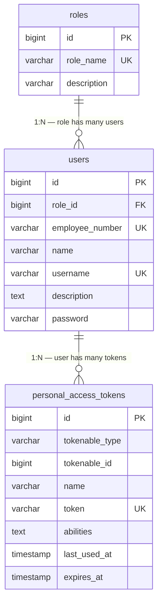
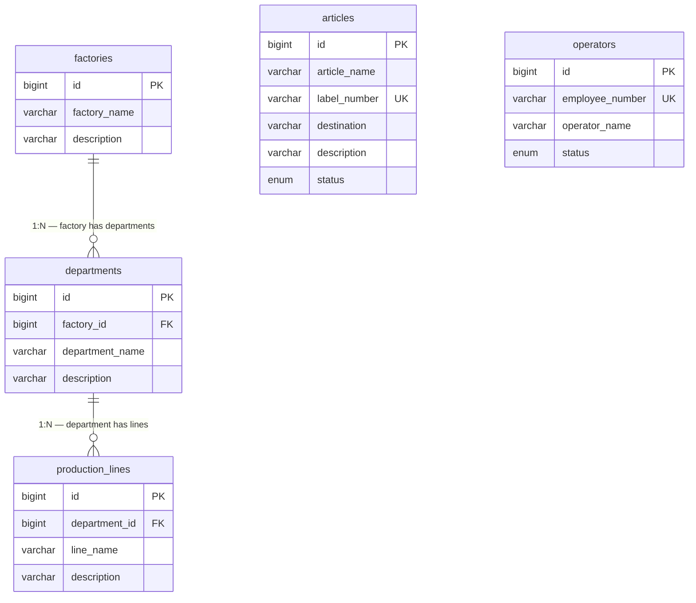
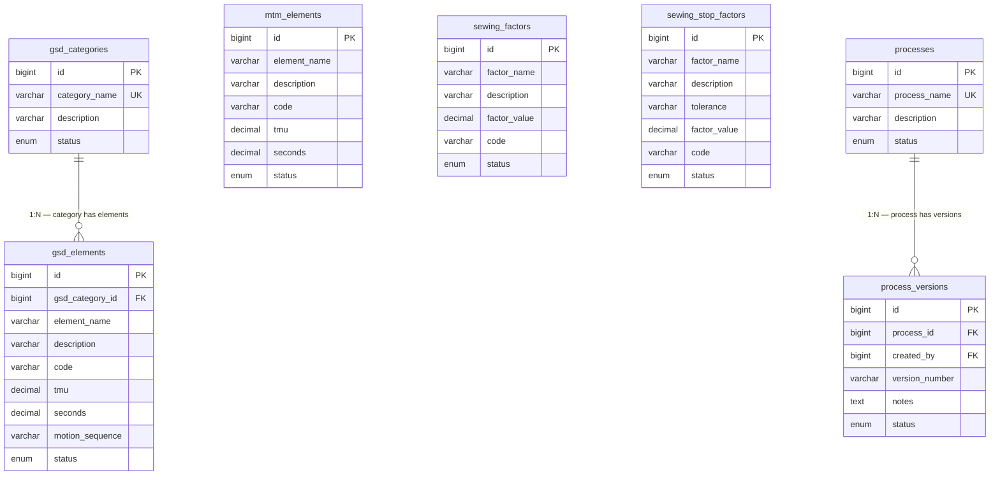
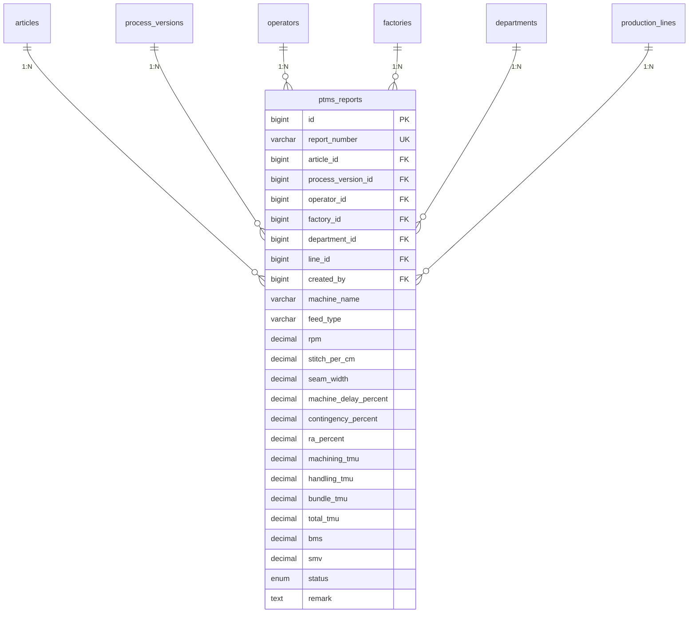

# Entity Relationship Diagram

## LEAN ENTERPRISE (LIMS) — Database ERD

> **Version:** 1.0  
> **Date:** 2026-09-05  
> **Scope:** All implemented database tables  
> **Notation:** Crow's Foot  

---

## Table of Contents

1. [Complete ER Diagram](#1-complete-er-diagram)
2. [Module: Authentication & Authorization](#2-module-authentication--authorization)
3. [Module: Organization & Master Data](#3-module-organization--master-data)
4. [Module: Process Library (GSD / MTM)](#4-module-process-library-gsd--mtm)
5. [Module: Production Engineering (PTMS)](#5-module-production-engineering-ptms)
6. [Relationships Summary](#6-relationships-summary)

---

## 1. Complete ER Diagram

```mermaid
erDiagram

    %% ============================================================
    %% MODULE 1 — AUTHENTICATION & AUTHORIZATION
    %% ============================================================

    roles {
        bigint id PK "AI"
        varchar role_name "UNIQUE, NOT NULL"
        varchar description "nullable"
        timestamp created_at
        timestamp updated_at
    }

    users {
        bigint id PK "AI"
        bigint role_id FK "→ roles.id"
        varchar employee_number "UNIQUE, nullable"
        varchar name "NOT NULL"
        varchar username "UNIQUE, NOT NULL"
        text description "nullable"
        varchar password "bcrypt hashed"
        varchar remember_token "nullable"
        timestamp email_verified_at "nullable"
        timestamp created_at
        timestamp updated_at
    }

    personal_access_tokens {
        bigint id PK "AI"
        varchar tokenable_type "NOT NULL"
        bigint tokenable_id "NOT NULL"
        varchar name "NOT NULL"
        varchar token "UNIQUE, NOT NULL"
        text abilities "nullable"
        timestamp last_used_at "nullable"
        timestamp expires_at "nullable"
        timestamp created_at
        timestamp updated_at
    }

    password_reset_tokens {
        varchar email PK "NOT NULL"
        varchar token "NOT NULL"
        timestamp created_at
    }

    %% ============================================================
    %% MODULE 2 — ORGANIZATION & MASTER DATA
    %% ============================================================

    factories {
        bigint id PK "AI"
        varchar factory_name "NOT NULL"
        varchar description "nullable"
        timestamp created_at
        timestamp updated_at
    }

    departments {
        bigint id PK "AI"
        bigint factory_id FK "→ factories.id"
        varchar department_name "NOT NULL"
        varchar description "nullable"
        timestamp created_at
        timestamp updated_at
    }

    production_lines {
        bigint id PK "AI"
        bigint department_id FK "→ departments.id"
        varchar line_name "NOT NULL"
        varchar description "nullable"
        timestamp created_at
        timestamp updated_at
    }

    articles {
        bigint id PK "AI"
        varchar article_name "NOT NULL"
        varchar label_number "UNIQUE, NOT NULL"
        varchar destination "NOT NULL"
        varchar description "nullable"
        enum status "active|inactive, default active"
        timestamp created_at
        timestamp updated_at
    }

    operators {
        bigint id PK "AI"
        varchar employee_number "UNIQUE, NOT NULL"
        varchar operator_name "NOT NULL"
        enum status "active|inactive, default active"
        timestamp created_at
        timestamp updated_at
    }

    %% ============================================================
    %% MODULE 3 — PROCESS LIBRARY (GSD / MTM)
    %% ============================================================

    gsd_categories {
        bigint id PK "AI"
        varchar category_name "UNIQUE, NOT NULL"
        varchar description "nullable"
        enum status "active|inactive, default active"
        timestamp created_at
        timestamp updated_at
    }

    gsd_elements {
        bigint id PK "AI"
        bigint gsd_category_id FK "→ gsd_categories.id"
        varchar element_name "NOT NULL"
        varchar description "nullable"
        varchar code "NOT NULL, INDEX"
        decimal tmu "10,2 NOT NULL"
        decimal seconds "10,2 NOT NULL"
        varchar motion_sequence "nullable"
        enum status "active|inactive, default active"
        timestamp created_at
        timestamp updated_at
    }

    mtm_elements {
        bigint id PK "AI"
        varchar element_name "NOT NULL"
        varchar description "nullable"
        varchar code "NOT NULL"
        decimal tmu "10,2 NOT NULL"
        decimal seconds "10,2 NOT NULL"
        enum status "active|inactive, default active"
        timestamp created_at
        timestamp updated_at
    }

    sewing_factors {
        bigint id PK "AI"
        varchar factor_name "NOT NULL"
        varchar description "nullable"
        decimal factor_value "10,2 NOT NULL"
        varchar code "NOT NULL"
        enum status "active|inactive, default active"
        timestamp created_at
        timestamp updated_at
    }

    sewing_stop_factors {
        bigint id PK "AI"
        varchar factor_name "NOT NULL"
        varchar description "nullable"
        varchar tolerance "nullable"
        decimal factor_value "10,2 NOT NULL"
        varchar code "NOT NULL"
        enum status "active|inactive, default active"
        timestamp created_at
        timestamp updated_at
    }

    processes {
        bigint id PK "AI"
        varchar process_name "UNIQUE, NOT NULL"
        varchar description "nullable"
        enum status "active|inactive, default active"
        timestamp created_at
        timestamp updated_at
    }

    process_versions {
        bigint id PK "AI"
        bigint process_id FK "→ processes.id"
        varchar version_number "NOT NULL"
        text notes "nullable"
        enum status "draft|active|archived"
        bigint created_by FK "→ users.id"
        timestamp created_at
        timestamp updated_at
    }

    %% ============================================================
    %% MODULE 4 — PRODUCTION ENGINEERING (PTMS)
    %% ============================================================

    ptms_reports {
        bigint id PK "AI"
        varchar report_number "UNIQUE, NOT NULL"
        bigint article_id FK "→ articles.id"
        bigint process_version_id FK "→ process_versions.id"
        bigint operator_id FK "→ operators.id"
        bigint factory_id FK "→ factories.id"
        bigint department_id FK "→ departments.id"
        bigint line_id FK "→ production_lines.id"
        bigint created_by FK "→ users.id"
        varchar machine_name "nullable"
        varchar feed_type "nullable"
        decimal rpm "10,2 nullable"
        decimal stitch_per_cm "10,2 nullable"
        decimal seam_width "10,2 nullable"
        decimal machine_delay_percent "10,2 nullable"
        decimal contingency_percent "10,2 nullable"
        decimal ra_percent "10,2 nullable"
        decimal machining_tmu "10,2 nullable"
        decimal handling_tmu "10,2 nullable"
        decimal bundle_tmu "10,2 nullable"
        decimal total_tmu "10,2 nullable"
        decimal bms "10,2 nullable"
        decimal smv "10,2 nullable"
        enum status "draft|final|archived"
        text remark "nullable"
        timestamp created_at
        timestamp updated_at
    }

    %% ============================================================
    %% RELATIONSHIPS
    %% ============================================================

    %% Auth
    roles ||--o{ users : "has"
    users ||--o{ personal_access_tokens : "has tokens"
    users ||--o{ personal_access_tokens : "tokenable"

    %% Organization Hierarchy
    factories ||--o{ departments : "contains"
    departments ||--o{ production_lines : "contains"

    %% Process Library
    gsd_categories ||--o{ gsd_elements : "contains"
    processes ||--o{ process_versions : "has versions"
    users ||--o{ process_versions : "created by"

    %% PTMS Reports — Central Entity
    articles ||--o{ ptms_reports : "referenced in"
    process_versions ||--o{ ptms_reports : "used in"
    operators ||--o{ ptms_reports : "performed by"
    factories ||--o{ ptms_reports : "at factory"
    departments ||--o{ ptms_reports : "in department"
    production_lines ||--o{ ptms_reports : "on line"
    users ||--o{ ptms_reports : "created by"
```



---

## 2. Module: Authentication & Authorization



**Role Seed Data:**
| id | role_name | description |
|----|-----------|-------------|
| 1 | developer | Full system access |
| 2 | admin | Master data & user management |
| 3 | viewer | Read-only access |

---

## 3. Module: Organization & Master Data



**Hierarchy:**
```
Factory
  └── Department
        └── Production Line
```

---

## 4. Module: Process Library (GSD / MTM)



**Process Version Lifecycle:**
```
draft → active → archived
```

---

## 5. Module: Production Engineering (PTMS)



**PTMS Report Status Lifecycle:**
```
draft → final → archived
```

---

## 6. Relationships Summary

| Relationship | Type | Foreign Key | On Update | On Delete |
|-------------|------|-------------|-----------|-----------|
| `roles` → `users` | 1:N | `users.role_id` | CASCADE | RESTRICT |
| `factories` → `departments` | 1:N | `departments.factory_id` | CASCADE | RESTRICT |
| `departments` → `production_lines` | 1:N | `production_lines.department_id` | CASCADE | RESTRICT |
| `gsd_categories` → `gsd_elements` | 1:N | `gsd_elements.gsd_category_id` | CASCADE | RESTRICT |
| `processes` → `process_versions` | 1:N | `process_versions.process_id` | CASCADE | RESTRICT |
| `users` → `process_versions` | 1:N | `process_versions.created_by` | CASCADE | RESTRICT |
| `articles` → `ptms_reports` | 1:N | `ptms_reports.article_id` | CASCADE | RESTRICT |
| `process_versions` → `ptms_reports` | 1:N | `ptms_reports.process_version_id` | CASCADE | RESTRICT |
| `operators` → `ptms_reports` | 1:N | `ptms_reports.operator_id` | CASCADE | RESTRICT |
| `factories` → `ptms_reports` | 1:N | `ptms_reports.factory_id` | CASCADE | RESTRICT |
| `departments` → `ptms_reports` | 1:N | `ptms_reports.department_id` | CASCADE | RESTRICT |
| `production_lines` → `ptms_reports` | 1:N | `ptms_reports.line_id` | CASCADE | RESTRICT |
| `users` → `ptms_reports` | 1:N | `ptms_reports.created_by` | CASCADE | RESTRICT |

**Total Tables:** 16 (implemented)  
**Total Relationships:** 13 foreign key constraints  
**Central Entity:** `ptms_reports` — connects to 7 other tables
