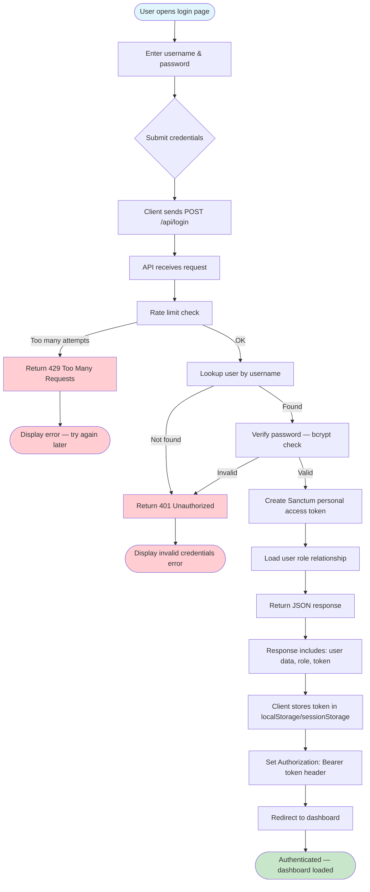
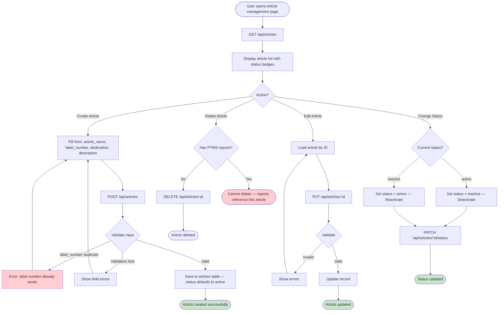
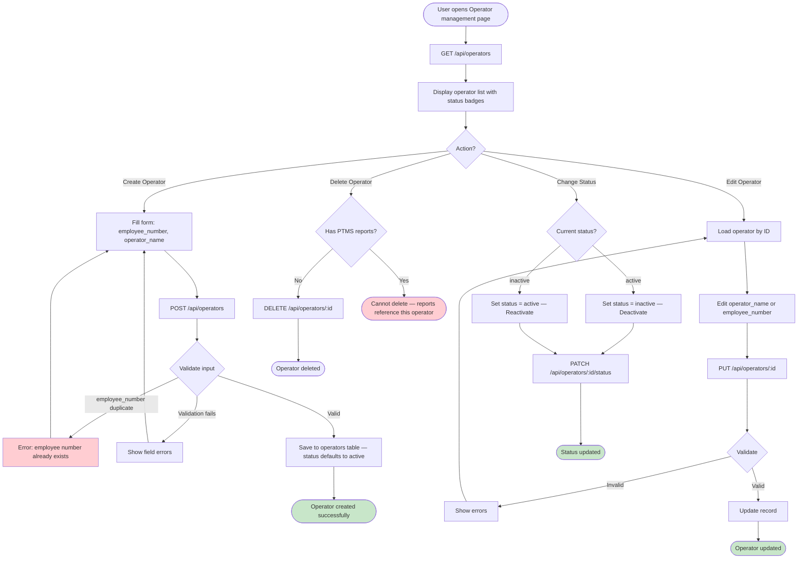
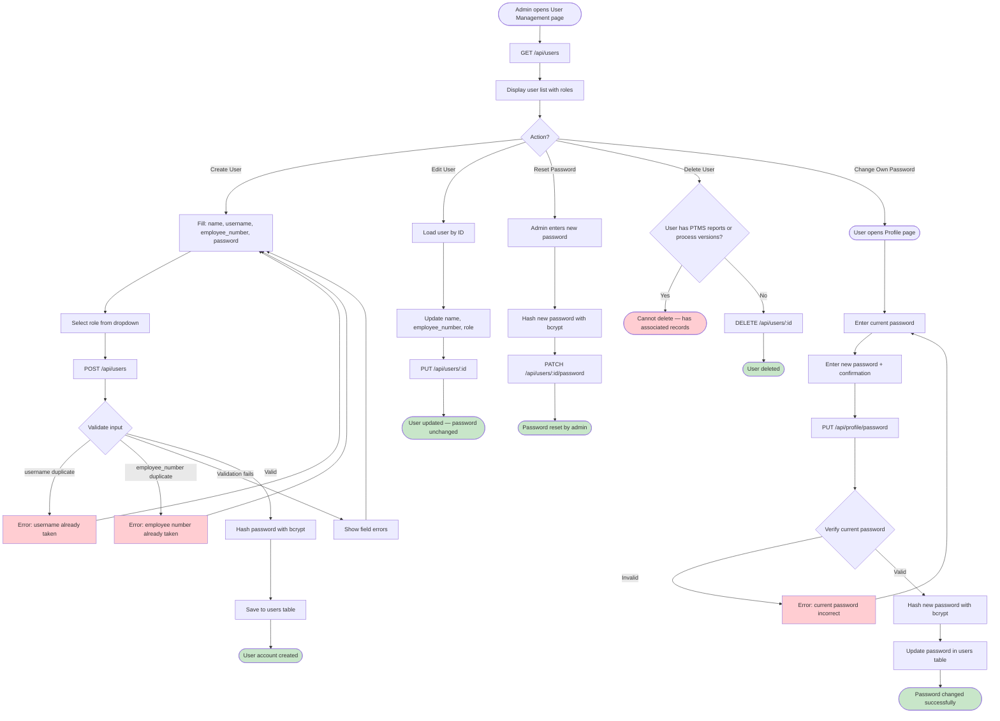
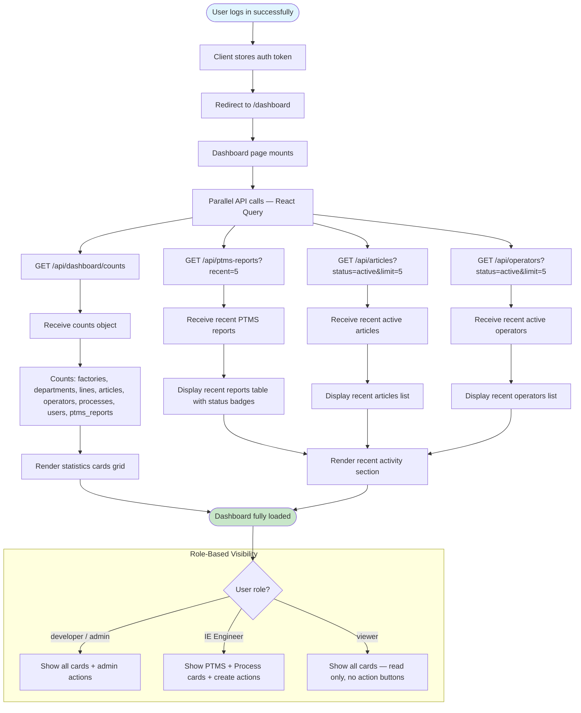

# Activity Diagrams

## LEAN ENTERPRISE (LIMS) — Activity / Flow Diagrams

> **Version:** 1.0  
> **Date:** 2026-09-05  
> **Notation:** Mermaid `flowchart TD`  

---

## Table of Contents

1. [Authentication Flow](#1-authentication-flow)
2. [Factory / Department / Line Management](#2-factory--department--line-management)
3. [Article Management](#3-article-management)
4. [Operator Management](#4-operator-management)
5. [Process Library Management](#5-process-library-management)
6. [PTMS Report Creation (Main Workflow)](#6-ptms-report-creation-main-workflow)
7. [User / Credential Management](#7-user--credential-management)
8. [Dashboard View](#8-dashboard-view)

---

## 1. Authentication Flow



---

## 2. Factory / Department / Line Management

```mermaid
flowchart TD
    subgraph Factory["Factory Management"]
        A([Admin opens Factory page]) --> B{Action?}
        B -->|Create| C[Fill factory_name, description]
        C --> D[POST /api/factories]
        D --> E{Validate input}
        E -->|Invalid| F[Show validation errors]
        F --> C
        E -->|Valid| G[Save to factories table]
        G --> H([Factory created successfully])
        B -->|View List| I[GET /api/factories]
        I --> J([Display factory list with department counts])
        B -->|Edit| K[Load factory data]
        K --> L[Update fields]
        L --> M[PUT /api/factories/:id]
        M --> N{Validate}
        N -->|Invalid| F
        N -->|Valid| O[Update record]
        O --> P([Factory updated])
        B -->|Delete| Q{Confirm deletion}
        Q -->|Cancel| R([Abort])
        Q -->|Confirm| S[DELETE /api/factories/:id]
        S --> T{Has departments?}
        T -->|Yes| U([Cannot delete — restrict FK])
        T -->|No| V[Delete record]
        V --> W([Factory deleted])
    end

    subgraph Department["Department Management"]
        X([Admin opens Department page]) --> Y{Action?}
        Y -->|Create| Z[Select factory, fill department_name, description]
        Z --> AA[POST /api/departments]
        AA --> AB{Validate}
        AB -->|Invalid| AC[Show validation errors]
        AC --> Z
        AB -->|Valid| AD[Save to departments table]
        AD --> AE([Department created])
        Y -->|View List| AF[GET /api/departments]
        AF --> AG([Display departments grouped by factory])
        Y -->|Edit| AH[Update department fields]
        AH --> AI[PUT /api/departments/:id]
        AI --> AJ([Department updated])
        Y -->|Delete| AK{Has production lines?}
        AK -->|Yes| AL([Cannot delete — restrict FK])
        AK -->|No| AM[DELETE /api/departments/:id]
        AM --> AN([Department deleted])
    end

    subgraph Line["Production Line Management"]
        AO([Admin opens Line page]) --> AP{Action?}
        AP -->|Create| AQ[Select factory → department, fill line_name]
        AQ --> AR[POST /api/production-lines]
        AR --> AS{Validate}
        AS -->|Invalid| AT[Show validation errors]
        AT --> AQ
        AS -->|Valid| AU[Save to production_lines table]
        AU --> AV([Line created])
        AP -->|View List| AW[GET /api/production-lines]
        AW --> AX([Display lines grouped by dept → factory])
        AP -->|Edit| AY[Update line fields]
        AY --> AZ[PUT /api/production-lines/:id]
        AZ --> BA([Line updated])
        AP -->|Delete| BB{Has PTMS reports?}
        BB -->|Yes| BC([Cannot delete — restrict FK])
        BB -->|No| BD[DELETE /api/production-lines/:id]
        BD --> BE([Line deleted])
    end

    style H fill:#c8e6c9
    style AE fill:#c8e6c9
    style AV fill:#c8e6c9
    style U fill:#ffcdd2
    style AL fill:#ffcdd2
    style BC fill:#ffcdd2
```



---

## 3. Article Management



---

## 4. Operator Management



---

## 5. Process Library Management

```mermaid
flowchart TD
    subgraph ProcessMgmt["Process & Version Management"]
        A([User opens Process Library page]) --> B{Manage what?}

        B -->|Processes| C[GET /api/processes]
        C --> D[Display process list]
        D --> E{Action?}
        E -->|Create| F[Fill process_name, description]
        F --> G[POST /api/processes]
        G --> H{Validate — unique name?}
        H -->|Duplicate| I[Error: process name exists]
        I --> F
        H -->|Valid| J[Save process — status: active]
        J --> K([Process created])
        E -->|Edit| L[Update process fields]
        L --> M[PUT /api/processes/:id]
        M --> N([Process updated])
        E -->|Add Version| O[Select process]
        O --> P[Fill version_number, notes]
        P --> Q[POST /api/process-versions]
        Q --> R[Save version — status: draft]
        R --> S([Version created as draft])
        E -->|Version Lifecycle| T{Current status?}
        T -->|draft| U[Activate → status: active]
        T -->|active| V[Archive → status: archived]
        U --> W[PATCH /api/process-versions/:id/status]
        V --> W
        W --> X([Version status updated])
    end

    subgraph GSDMgmt["GSD Category & Element Management"]
        Y([User opens GSD Management]) --> Z{Manage what?}

        Z -->|Categories| AA[GET /api/gsd-categories]
        AA --> AB[Display category list]
        AB --> AC{Action?}
        AC -->|Create| AD[Fill category_name, description]
        AD --> AE[POST /api/gsd-categories]
        AE --> AF([Category created])
        AC -->|Edit| AG[Update category]
        AG --> AH([Category updated])
        AC -->|Toggle Status| AI[Toggle active/inactive]
        AI --> AJ([Status changed])

        Z -->|Elements| AK[Select category or view all]
        AK --> AL[GET /api/gsd-elements]
        AL --> AM[Display elements with TMU, code, motion sequence]
        AM --> AN{Action?}
        AN -->|Create| AO[Fill: element_name, code, tmu, seconds, motion_sequence]
        AO --> AP[POST /api/gsd-elements]
        AP --> AQ([Element created])
        AN -->|Edit| AR[Update element fields]
        AR --> AS([Element updated])
        AN -->|Toggle Status| AT[Toggle active/inactive]
        AT --> AU([Status changed])
    end

    subgraph MTMMgmt["MTM Element Management"]
        AV([User opens MTM Management]) --> AW[GET /api/mtm-elements]
        AW --> AX[Display MTM elements list]
        AX --> AY{Action?}
        AY -->|Create| AZ[Fill: element_name, code, tmu, seconds]
        AZ --> BA[POST /api/mtm-elements]
        BA --> BB([MTM element created])
        AY -->|Edit| BC[Update MTM element]
        BC --> BD([MTM element updated])
        AY -->|Toggle Status| BE[Toggle active/inactive]
        BE --> BF([Status changed])
    end

    subgraph FactorMgmt["Sewing & Stop Factor Management"]
        BG([User opens Factor Management]) --> BH{Manage what?}

        BH -->|Sewing Factors| BI[GET /api/sewing-factors]
        BI --> BJ[Display factors: name, code, value]
        BJ --> BK{Action?}
        BK -->|Create| BL[Fill: factor_name, code, factor_value]
        BL --> BM[POST /api/sewing-factors]
        BM --> BN([Factor created])
        BK -->|Edit| BO[Update factor]
        BO --> BP([Factor updated])

        BH -->|Stop Factors| BQ[GET /api/sewing-stop-factors]
        BQ --> BR[Display stop factors: name, tolerance, value]
        BR --> BS{Action?}
        BS -->|Create| BT[Fill: factor_name, tolerance, code, factor_value]
        BT --> BU[POST /api/sewing-stop-factors]
        BU --> BV([Stop factor created])
        BS -->|Edit| BW[Update stop factor]
        BW --> BX([Stop factor updated])
    end

    style K fill:#c8e6c9
    style S fill:#c8e6c9
    style X fill:#c8e6c9
    style AF fill:#c8e6c9
    style AQ fill:#c8e6c9
    style BB fill:#c8e6c9
    style BN fill:#c8e6c9
    style BV fill:#c8e6c9
    style I fill:#ffcdd2
```



---

## 6. PTMS Report Creation (Main Workflow)

```mermaid
flowchart TD
    A([IE Engineer starts new PTMS Report]) --> B[Step 1: Select References]

    subgraph Step1["Step 1 — Reference Selection"]
        B --> C[Select Article from dropdown]
        C --> D[Select Process Version from dropdown]
        D --> E[Select Operator from dropdown]
        E --> F[Select Factory → Department → Line — cascading dropdowns]
        F --> G{All references selected?}
        G -->|No| H[Show required field errors]
        H --> C
        G -->|Yes| I[Proceed to Step 2]
    end

    subgraph Step2["Step 2 — Machine Specifications"]
        I --> J[Enter machine_name]
        J --> K[Enter feed_type]
        K --> L[Enter RPM]
        L --> M[Enter stitch_per_cm]
        M --> N[Enter seam_width]
        N --> O[Enter fabric_weight]
        O --> P[Proceed to Step 3]
    end

    subgraph Step3["Step 3 — GSD Elements & Observations"]
        P --> Q[Select GSD Category]
        Q --> R[Load GSD elements for category]
        R --> S[Add GSD elements to report]
        S --> T[Enter observed_time for each element]
        T --> U[Enter rating for each element]
        U --> V{Add more elements?}
        V -->|Yes| Q
        V -->|No| W[Proceed to calculations]
    end

    subgraph Step4["Step 4 — SMV Calculations"]
        W --> X[Calculate total_observed_time = SUM of all observed times]
        X --> Y[Calculate average_rating = weighted average of ratings]
        Y --> Z[Calculate basic_minute_value = total_observed_time × rating_factor]
        Z --> AA[Apply allowances: allowances %]
        AA --> AB[Calculate SMV = basic_minute_value × allowances]
        AB --> AC[Display calculated values]
        AC --> AD[User reviews all values]
    end

    subgraph Step5["Step 5 — Save & Lifecycle"]
        AD --> AE{Ready to save?}
        AE -->|Review needed| AF[Save as DRAFT — status: draft]
        AF --> AG([Report saved as draft — editable])
        AE -->|Ready| AH[POST /api/ptms-reports]
        AH --> AI{Validate all fields}
        AI -->|Invalid| AJ[Show validation errors]
        AJ --> AD
        AI -->|Valid| AK[Generate report_number]
        AK --> AL[Save to ptms_reports table — status: draft]
        AL --> AM([Report created successfully])
    end

    subgraph Step6["Step 6 — Review & Finalize"]
        AM --> AN[IE Engineer reviews draft report]
        AN --> AO{Action?}
        AO -->|Edit| AP[Modify report fields]
        AP --> AQ[PUT /api/ptms-reports/:id]
        AQ --> AR([Report updated])
        AO -->|Finalize| AS[Set status = final]
        AS --> AT[PATCH /api/ptms-reports/:id/status]
        AT --> AU([Report finalized — read-only])
        AO -->|Archive| AV[Set status = archived]
        AV --> AW[PATCH /api/ptms-reports/:id/status]
        AW --> AX([Report archived])
    end

    style A fill:#e1f5fe
    style AM fill:#c8e6c9
    style AU fill:#c8e6c9
    style AX fill:#fff9c4
    style H fill:#ffcdd2
    style AJ fill:#ffcdd2
```



**SMV Calculation Formula:**
```
Total Observed Time = Σ(observed_time × rating) for all elements
Basic Minute Value  = Total Observed Time × Rating Factor
SMV                 = Basic Minute Value × (1 + Allowances%)
```

---

## 7. User / Credential Management



---

## 8. Dashboard View



**Dashboard Statistics Cards:**
| Card | Source | Icon |
|------|--------|------|
| Total Factories | `factories.count()` | Factory |
| Total Departments | `departments.count()` | Building |
| Total Production Lines | `production_lines.count()` | Assembly |
| Total Articles | `articles.where('status','active').count()` | Tag |
| Total Operators | `operators.where('status','active').count()` | Users |
| Total Processes | `processes.count()` | List |
| Total PTMS Reports | `ptms_reports.count()` | Clipboard |
| Active Users | `users.count()` | User |
