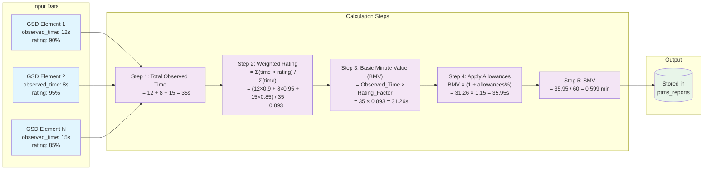

# Data Flow Diagrams

## LEAN ENTERPRISE (LIMS) — Data Flow Diagrams

> **Version:** 1.0  
> **Date:** 2026-09-05  
> **Notation:** Mermaid `flowchart` (DFD-style)  
> **Levels:** Context & Detailed  

---

## Table of Contents

1. [Authentication DFD](#1-authentication-dfd)
2. [Master Data CRUD DFD](#2-master-data-crud-dfd)
3. [PTMS Report DFD](#3-ptms-report-dfd)
4. [Process Library DFD](#4-process-library-dfd)
5. [User Management DFD](#5-user-management-dfd)
6. [System Context Diagram](#6-system-context-diagram)

---

## 1. Authentication DFD

### Context Level — Login Flow

```mermaid
flowchart LR
    subgraph External["External Entities"]
        User([User / Browser])
    end

    subgraph System["LIMS System"]
        direction TB
        API[("Laravel API
        /api/login")]
        AuthSvc[("Auth Service
        Sanctum")]
        DB[(("MySQL
        Database"))]
    end

    User -->|"1. Login Request
    {username, password}"| API
    API -->|"2. Validate credentials"| DB
    DB -->|"3. User record"| API
    API -->|"4. Create token"| AuthSvc
    AuthSvc -->|"5. Token generated"| API
    API -->|"6. Token stored"| DB
    API -->|"7. Login Response
    {user, role, token}"| User
    User -->|"8. Store token
    localStorage"| User

    style User fill:#e1f5fe
    style API fill:#fff3e0
    style AuthSvc fill:#f3e5f5
    style DB fill:#e8f5e9
```

### Detailed DFD — Authentication

```mermaid
flowchart TD
    subgraph Client["Client Layer"]
        Browser([Browser / SPA])
        TokenStore[(Token Storage
        localStorage)]
    end

    subgraph API["API Layer"]
        LoginRoute["POST /api/login
        Route Handler"]
        RateLimit{"Rate Limit
        Middleware"}
        AuthController["Auth Controller
        login()"]
        Validator["Input Validator
        Form Request"]
        Sanctum["Sanctum Token
        Manager"]
    end

    subgraph Data["Data Layer"]
        UsersDB[(("users table"))]
        TokensDB[(("personal_access_tokens
        table"))]
    end

    Browser -->|"1. POST /api/login
    {username, password}"| LoginRoute
    LoginRoute -->|"2. Check rate limit
    (5 attempts/min)"| RateLimit
    RateLimit -->|"3. Pass"| AuthController
    RateLimit -.->|"3a. Block → 429"| Browser
    AuthController -->|"4. Validate input"| Validator
    Validator -->|"5. Return validated data"| AuthController
    AuthController -->|"6. Find user by username"| UsersDB
    UsersDB -->|"7. User record + password hash"| AuthController
    AuthController -->|"8. Verify bcrypt(password, hash)"| AuthController
    AuthController -.->|"8a. Invalid → 401"| Browser
    AuthController -->|"9. Create token"| Sanctum
    Sanctum -->|"10. Store token hash"| TokensDB
    Sanctum -->|"11. Return plain text token"| AuthController
    AuthController -->|"12. Load role relationship"| UsersDB
    UsersDB -->|"13. Role data"| AuthController
    AuthController -->|"14. Return {user, role, token}"| Browser
    Browser -->|"15. Persist token"| TokenStore

    style Browser fill:#e1f5fe
    style TokenStore fill:#e1f5fe
    style LoginRoute fill:#fff3e0
    style RateLimit fill:#fff3e0
    style AuthController fill:#fff3e0
    style Validator fill:#fff3e0
    style Sanctum fill:#f3e5f5
    style UsersDB fill:#e8f5e9
    style TokensDB fill:#e8f5e9
```

---

## 2. Master Data CRUD DFD

### General Master Data Pattern

```mermaid
flowchart TD
    subgraph Client["Client Layer"]
        SPA([SPA Client
        Next.js])
    end

    subgraph API["API Layer"]
        direction TB
        Route["API Route
        /api/{resource}"]
        Middleware["Auth Middleware
        Sanctum Guard"]
        Controller["Resource Controller
        index/show/store/update/destroy"]
        FormReq["Form Request
        Validation"]
        Resource["API Resource
        JSON Serialization"]
    end

    subgraph DB["Data Layer"]
        Database[(("MySQL
        Database"))]
    end

    SPA -->|"1. HTTP Request
    GET/POST/PUT/DELETE"| Route
    Route -->|"2. Verify token"| Middleware
    Middleware -->|"3. Authenticated"| Controller
    Controller -->|"4. Validate input"| FormReq
    FormReq -->|"5. Validated data"| Controller
    Controller -->|"6. Query / Write"| Database
    Database -->|"7. Result set"| Controller
    Controller -->|"8. Transform"| Resource
    Resource -->|"9. JSON Response"| SPA
    SPA -->|"10. Update UI state
    React Query cache"| SPA

    style SPA fill:#e1f5fe
    style Route fill:#fff3e0
    style Middleware fill:#fce4ec
    style Controller fill:#fff3e0
    style FormReq fill:#fff3e0
    style Resource fill:#fff3e0
    style Database fill:#e8f5e9
```

### Cascading Dropdowns — Organization Hierarchy

```mermaid
flowchart LR
    subgraph Client["Client — Cascading Dropdowns"]
        DD1["Factory Dropdown"]
        DD2["Department Dropdown
        (filtered by factory)"]
        DD3["Line Dropdown
        (filtered by department)"]
    end

    subgraph API["API Endpoints"]
        EP1["GET /api/factories"]
        EP2["GET /api/departments
        ?factory_id=X"]
        EP3["GET /api/production-lines
        ?department_id=Y"]
    end

    subgraph DB[(Database)]
        T1[(factories)]
        T2[(departments)]
        T3[(production_lines)]
    end

    DD1 -->|"Select factory"| EP1
    EP1 --> T1
    T1 -->|"Factory list"| EP1
    EP1 -->|"Response"| DD1
    DD1 -->|"factory_id changed"| DD2
    DD2 -->|"Fetch departments"| EP2
    EP2 --> T2
    T2 -->|"Filtered departments"| EP2
    EP2 -->|"Response"| DD2
    DD2 -->|"department_id changed"| DD3
    DD3 -->|"Fetch lines"| EP3
    EP3 --> T3
    T3 -->|"Filtered lines"| EP3
    EP3 -->|"Response"| DD3

    style DD1 fill:#e1f5fe
    style DD2 fill:#e1f5fe
    style DD3 fill:#e1f5fe
    style EP1 fill:#fff3e0
    style EP2 fill:#fff3e0
    style EP3 fill:#fff3e0
    style T1 fill:#e8f5e9
    style T2 fill:#e8f5e9
    style T3 fill:#e8f5e9
```

---

## 3. PTMS Report DFD

### Context Level — PTMS Report System

```mermaid
flowchart LR
    subgraph External["External Entities"]
        IE([IE Engineer])
        Admin([Admin / Viewer])
    end

    subgraph System["LIMS PTMS Module"]
        direction TB
        PTMS["PTMS Report
        Management"]
        Calc["SMV Calculation
        Engine"]
        DB[(("ptms_reports
        Database"))]
    end

    IE -->|"Create report data
    article, operator, machine specs,
    GSD elements, observed times"| PTMS
    PTMS -->|"Raw report data"| Calc
    Calc -->|"Calculated SMV, BMV,
    total TMU"| PTMS
    PTMS -->|"Store report"| DB
    DB -->|"Retrieve reports"| PTMS
    PTMS -->|"Report details + SMV"| IE
    PTMS -->|"Report summaries"| Admin

    style IE fill:#e1f5fe
    style Admin fill:#e1f5fe
    style PTMS fill:#fff3e0
    style Calc fill:#f3e5f5
    style DB fill:#e8f5e9
```

### Detailed DFD — PTMS Report Creation & Calculation

```mermaid
flowchart TD
    subgraph Client["Client Layer"]
        Browser([IE Engineer
        Browser])
        FormState[(React Hook Form
        Form State)]
    end

    subgraph API["API Layer"]
        direction TB
        ReportRoute["POST /api/ptms-reports"]
        AuthMW["Auth Middleware
        Sanctum"]
        ReportController["PTMS Report
        Controller"]
        ReportValidator["Form Request
        Validation"]
        ReportResource["PTMS Report
        API Resource"]
    end

    subgraph Calculation["Calculation Engine"]
        direction TB
        ObservedTime["P1: Total Observed Time
        Σ(element_observed_time)"]
        RatingCalc["P2: Average Rating
        weighted average"]
        BMVCalc["P3: Basic Minute Value
        = Observed_Time × Rating_Factor"]
        AllowanceCalc["P4: Apply Allowances
        = BMV × (1 + allowances%)"]
        SMVCalc["P5: SMV
        = BMV with allowances applied"]
    end

    subgraph DB["Data Layer"]
        ReportsDB[(("ptms_reports"))]
        ArticlesDB[(("articles"))]
        ProcessDB[(("process_versions"))]
        OperatorsDB[(("operators"))]
        OrgDB[(("factories,
        departments,
        production_lines"))]
        GSDDB[(("gsd_categories,
        gsd_elements"))]
    end

    Browser -->|"1. Submit report form"| FormState
    FormState -->|"2. POST /api/ptms-reports
    {
      article_id, process_version_id,
      operator_id, factory_id, department_id,
      line_id, machine_name, feed_type,
      rpm, stitch_per_cm, seam_width,
      gsd_elements: [{id, observed_time, rating}]
    }"| ReportRoute
    ReportRoute -->|"3. Verify token"| AuthMW
    AuthMW -->|"4. Authenticated"| ReportController
    ReportController -->|"5. Validate"| ReportValidator
    ReportValidator -->|"6. Validated data"| ReportController

    ReportController -->|"7. Verify FK exists"| ArticlesDB
    ReportController -->|"7. Verify FK exists"| ProcessDB
    ReportController -->|"7. Verify FK exists"| OperatorsDB
    ReportController -->|"7. Verify FK exists"| OrgDB
    ReportController -->|"7. Verify FK exists"| GSDDB

    ReportController -->|"8. Send observed data"| ObservedTime
    ObservedTime -->|"9. Total observed time"| RatingCalc
    RatingCalc -->|"10. Average rating"| BMVCalc
    BMVCalc -->|"11. Basic Minute Value"| AllowanceCalc
    AllowanceCalc -->|"12. Adjusted BMV"| SMVCalc
    SMVCalc -->|"13. Final SMV value"| ReportController

    ReportController -->|"14. Generate report_number
    (PTMS-YYYYMMDD-XXXX)"| ReportController
    ReportController -->|"15. Save report"| ReportsDB
    ReportsDB -->|"16. Report saved"| ReportController
    ReportController -->|"17. Transform"| ReportResource
    ReportResource -->|"18. JSON Response
    {report, smv, bmv, total_tmu}"| Browser

    Browser -->|"19. Invalidate cache
    React Query refetch"| Browser

    style Browser fill:#e1f5fe
    style FormState fill:#e1f5fe
    style ReportRoute fill:#fff3e0
    style AuthMW fill:#fce4ec
    style ReportController fill:#fff3e0
    style ReportValidator fill:#fff3e0
    style ReportResource fill:#fff3e0
    style ObservedTime fill:#f3e5f5
    style RatingCalc fill:#f3e5f5
    style BMVCalc fill:#f3e5f5
    style AllowanceCalc fill:#f3e5f5
    style SMVCalc fill:#f3e5f5
    style ReportsDB fill:#e8f5e9
    style ArticlesDB fill:#e8f5e9
    style ProcessDB fill:#e8f5e9
    style OperatorsDB fill:#e8f5e9
    style OrgDB fill:#e8f5e9
    style GSDDB fill:#e8f5e9
```

### SMV Calculation Data Flow



---

## 4. Process Library DFD

```mermaid
flowchart TD
    subgraph Client["Client Layer"]
        User([IE Engineer / Admin])
    end

    subgraph API["API Layer"]
        direction TB
        ProcessCtrl["Process Controller"]
        VersionCtrl["Process Version
        Controller"]
        GSDCatCtrl["GSD Category
        Controller"]
        GSDElemCtrl["GSD Element
        Controller"]
        MTMCtrl["MTM Element
        Controller"]
        SewingCtrl["Sewing Factor
        Controller"]
        StopCtrl["Stop Factor
        Controller"]
    end

    subgraph DB["Data Layer"]
        Processes[(("processes"))]
        Versions[(("process_versions"))]
        GSDCats[(("gsd_categories"))]
        GSDElems[(("gsd_elements"))]
        MTMs[(("mtm_elements"))]
        SewFactors[(("sewing_factors"))]
        StopFactors[(("sewing_stop_factors"))]
    end

    subgraph Usage["Consumers"]
        PTMS([PTMS Reports])
    end

    User -->|"1. Create process
    {name, description}"| ProcessCtrl
    ProcessCtrl -->|"2. Save"| Processes
    Processes -->|"3. Process created"| ProcessCtrl

    User -->|"4. Add version
    {process_id, version_number, notes}"| VersionCtrl
    VersionCtrl -->|"5. Save — status: draft"| Versions
    Versions -->|"6. Version created"| VersionCtrl

    User -->|"7. Manage GSD categories"| GSDCatCtrl
    GSDCatCtrl -->|"8. CRUD"| GSDCats

    User -->|"9. Add GSD elements
    {category_id, name, code, tmu, seconds}"| GSDElemCtrl
    GSDElemCtrl -->|"10. Save"| GSDElems
    GSDElems -->|"11. FK → gsd_categories"| GSDCats

    User -->|"12. Manage MTM elements
    {name, code, tmu, seconds}"| MTMCtrl
    MTMCtrl -->|"13. CRUD"| MTMs

    User -->|"14. Manage sewing factors
    {name, code, factor_value}"| SewingCtrl
    SewingCtrl -->|"15. CRUD"| SewFactors

    User -->|"16. Manage stop factors
    {name, tolerance, code, factor_value}"| StopCtrl
    StopCtrl -->|"17. CRUD"| StopFactors

    Versions -->|"18. Referenced by"| PTMS
    GSDCats -->|"19. Selected in"| PTMS
    GSDElems -->|"20. Used for
    observed time entries"| PTMS

    style User fill:#e1f5fe
    style ProcessCtrl fill:#fff3e0
    style VersionCtrl fill:#fff3e0
    style GSDCatCtrl fill:#fff3e0
    style GSDElemCtrl fill:#fff3e0
    style MTMCtrl fill:#fff3e0
    style SewingCtrl fill:#fff3e0
    style StopCtrl fill:#fff3e0
    style Processes fill:#e8f5e9
    style Versions fill:#e8f5e9
    style GSDCats fill:#e8f5e9
    style GSDElems fill:#e8f5e9
    style MTMs fill:#e8f5e9
    style SewFactors fill:#e8f5e9
    style StopFactors fill:#e8f5e9
    style PTMS fill:#f3e5f5
```

### Process Version Lifecycle DFD

```mermaid
flowchart LR
    subgraph Actor["Actors"]
        IE([IE Engineer])
    end

    subgraph States["Version States"]
        Draft["draft
        (editable)"]
        Active["active
        (usable in PTMS)"]
        Archived["archived
        (read-only)"]
    end

    subgraph DB[(("process_versions"))]
    end

    IE -->|"Create version"| Draft
    IE -->|"Activate"| Active
    IE -->|"Archive"| Archived
    Draft -->|"Update fields"| Draft
    Draft -->|"Delete"| DB
    Active -->|"Used in PTMS reports"| Active
    Archived -.->|"Cannot edit"| Archived

    style Draft fill:#fff9c4
    style Active fill:#c8e6c9
    style Archived fill:#e0e0e0
    style IE fill:#e1f5fe
```

---

## 5. User Management DFD

```mermaid
flowchart TD
    subgraph Client["Client Layer"]
        Admin([Admin User])
        NormalUser([Normal User])
    end

    subgraph API["API Layer"]
        direction TB
        UserCtrl["User Controller
        CRUD operations"]
        ProfileCtrl["Profile Controller
        Password change"]
        Validator["Form Request
        Validation"]
        Hasher["Bcrypt Hasher
        Hash::make()"]
    end

    subgraph DB["Data Layer"]
        UsersDB[(("users table"))]
        RolesDB[(("roles table"))]
        TokensDB[(("personal_access_tokens"))]
    end

    subgraph Flow1["Admin Creates User"]
        Admin -->|"1. POST /api/users
        {name, username, employee_number,
        password, role_id}"| UserCtrl
        UserCtrl -->|"2. Validate"| Validator
        Validator -->|"3a. username unique?"| UsersDB
        Validator -->|"3b. employee_number unique?"| UsersDB
        Validator -->|"4. Validated data"| UserCtrl
        UserCtrl -->|"5. Hash password"| Hasher
        Hasher -->|"6. Bcrypt hash"| UserCtrl
        UserCtrl -->|"7. Verify role_id exists"| RolesDB
        UserCtrl -->|"8. INSERT user"| UsersDB
        UsersDB -->|"9. User created"| UserCtrl
        UserCtrl -->|"10. Response — password excluded"| Admin
    end

    subgraph Flow2["Admin Updates User"]
        Admin -->|"11. PUT /api/users/:id
        {name, employee_number, role_id}"| UserCtrl
        UserCtrl -->|"12. Validate"| Validator
        UserCtrl -->|"13. UPDATE user"| UsersDB
        UsersDB -->|"14. Updated"| UserCtrl
        UserCtrl -->|"15. Response"| Admin
    end

    subgraph Flow3["User Changes Own Password"]
        NormalUser -->|"16. PUT /api/profile/password
        {current_password, new_password,
        new_password_confirmation}"| ProfileCtrl
        ProfileCtrl -->|"17. Verify current password"| UsersDB
        ProfileCtrl -->|"18. Validate match"| ProfileCtrl
        ProfileCtrl -->|"19. Hash new password"| Hasher
        Hasher -->|"20. Bcrypt hash"| ProfileCtrl
        ProfileCtrl -->|"21. UPDATE password"| UsersDB
        UsersDB -->|"22. Password updated"| ProfileCtrl
        ProfileCtrl -->|"23. Success response"| NormalUser
    end

    subgraph Flow4["Admin Deletes User"]
        Admin -->|"24. DELETE /api/users/:id"| UserCtrl
        UserCtrl -->|"25. Check FK references"| UsersDB
        UsersDB -->|"26a. Has PTMS reports → block"| UserCtrl
        UserCtrl -->|"27. Cannot delete"| Admin
        UsersDB -->|"26b. No references"| UserCtrl
        UserCtrl -->|"28. DELETE"| UsersDB
        UsersDB -->|"29. Deleted"| UserCtrl
        UserCtrl -->|"30. Success"| Admin
    end

    style Admin fill:#e1f5fe
    style NormalUser fill:#e1f5fe
    style UserCtrl fill:#fff3e0
    style ProfileCtrl fill:#fff3e0
    style Validator fill:#fff3e0
    style Hasher fill:#f3e5f5
    style UsersDB fill:#e8f5e9
    style RolesDB fill:#e8f5e9
    style TokensDB fill:#e8f5e9
```

---

## 6. System Context Diagram

### Level 0 — System Context

```mermaid
flowchart TB
    subgraph Users["System Actors"]
        Dev([Developer
        Full Access])
        Admin([Admin
        User & Master Data Mgmt])
        IE([IE Engineer
        Process & PTMS Mgmt])
        Viewer([Viewer
        Read Only])
    end

    subgraph LIMS["LIMS — Lean & IE Management System"]
        direction TB
        Auth["Authentication
        & Authorization"]
        Master["Master Data
        Factory/Dept/Line
        Article/Operator"]
        ProcessLib["Process Library
        GSD/MTM/Sewing Factors
        Process Versions"]
        PTMSMod["PTMS Module
        Reports & SMV Calculation"]
        Dashboard["Dashboard
        Statistics & Views"]
    end

    subgraph DataStore["Data Stores"]
        MySQL[(("MySQL 8
        Database"))]
    end

    Dev -->|"Full CRUD + system config"| LIMS
    Admin -->|"User mgmt + master data CRUD"| LIMS
    IE -->|"Process library + PTMS reports"| LIMS
    Viewer -->|"View dashboards & reports"| LIMS

    Auth <-->|"Read/Write users, tokens"| MySQL
    Master <-->|"Read/Write org & master data"| MySQL
    ProcessLib <-->|"Read/Write process data"| MySQL
    PTMSMod <-->|"Read/Write reports"| MySQL
    Dashboard -->|"Read aggregated data"| MySQL

    style Dev fill:#ffcdd2
    style Admin fill:#fff9c4
    style IE fill:#c8e6c9
    style Viewer fill:#e1f5fe
    style Auth fill:#fff3e0
    style Master fill:#fff3e0
    style ProcessLib fill:#fff3e0
    style PTMSMod fill:#fff3e0
    style Dashboard fill:#fff3e0
    style MySQL fill:#e8f5e9
```

### Level 1 — Major Data Flows

```mermaid
flowchart TD
    subgraph Actors["Actors"]
        U([All Users])
    end

    subgraph Processes["Major Processes"]
        P1["1.0
        Authentication"]
        P2["2.0
        Organization
        Management"]
        P3["3.0
        Master Data
        Management"]
        P4["4.0
        Process Library
        Management"]
        P5["5.0
        PTMS Report
        Processing"]
        P6["6.0
        Dashboard
        Aggregation"]
    end

    subgraph DataStores["Data Stores"]
        D1[(("D1: Users
        & Roles"))]
        D2[(("D2: Organization
        Factory/Dept/Line"))]
        D3[(("D3: Master Data
        Articles/Operators"))]
        D4[(("D4: Process Library
        GSD/MTM/Factors"))]
        D5[(("D5: PTMS
        Reports"))]
    end

    U -->|"Login credentials"| P1
    P1 -->|"Validate"| D1
    P1 -->|"Auth token"| U

    U -->|"CRUD requests"| P2
    P2 <--> D2

    U -->|"CRUD requests"| P3
    P3 <--> D3

    U -->|"CRUD requests"| P4
    P4 <--> D4

    U -->|"Report data + GSD elements"| P5
    P5 -->|"Read process & elements"| D4
    P5 -->|"Read org & master data"| D2
    P5 -->|"Read articles/operators"| D3
    P5 -->|"Save report"| D5

    U -->|"View dashboard"| P6
    P6 -->|"Count queries"| D1
    P6 -->|"Count queries"| D2
    P6 -->|"Count queries"| D3
    P6 -->|"Count queries"| D4
    P6 -->|"Count & recent"| D5
    P6 -->|"Statistics"| U

    style U fill:#e1f5fe
    style P1 fill:#fff3e0
    style P2 fill:#fff3e0
    style P3 fill:#fff3e0
    style P4 fill:#fff3e0
    style P5 fill:#fff3e0
    style P6 fill:#fff3e0
    style D1 fill:#e8f5e9
    style D2 fill:#e8f5e9
    style D3 fill:#e8f5e9
    style D4 fill:#e8f5e9
    style D5 fill:#e8f5e9
```

---

## Legend

| Symbol | Meaning |
|--------|---------|
| `([ ])` | External entity (actor/user) |
| `[ ]` | Process / transformation |
| `[( )]` | Data store (database table) |
| `→` | Data flow (direction of movement) |
| `-.->` | Dashed: error/exception flow |
| Orange boxes | API / business logic layer |
| Blue boxes | Client / external entities |
| Green boxes | Database / data stores |
| Purple boxes | Calculation / specialized services |
