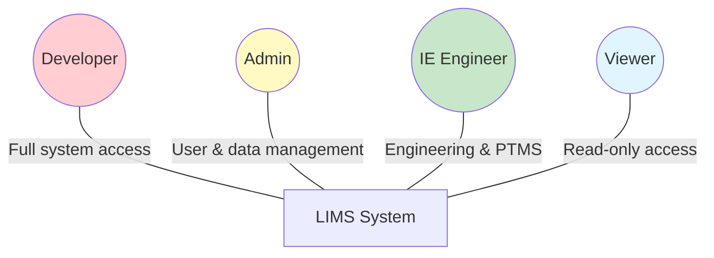
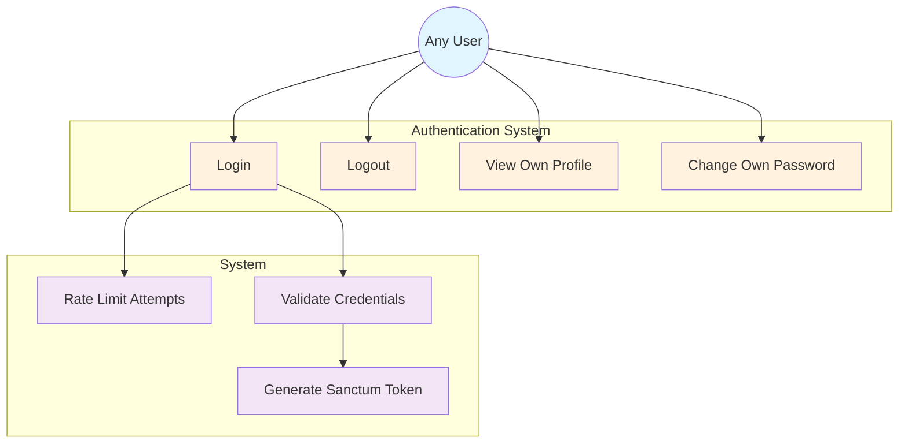
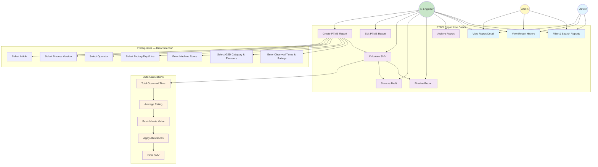
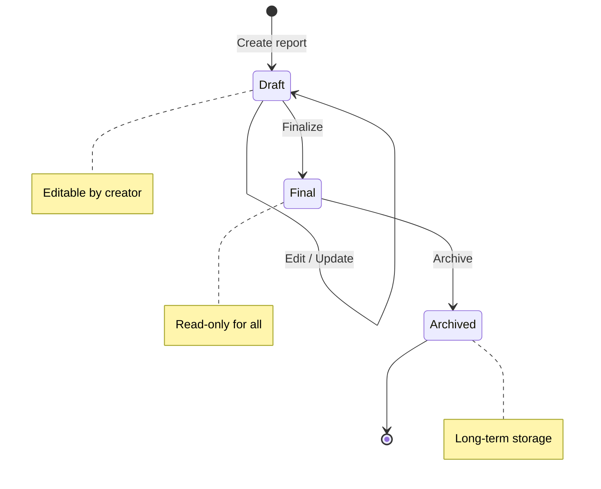

# Use Case Diagrams

## LEAN ENTERPRISE (LIMS) — Use Case Diagrams

> **Version:** 1.0  
> **Date:** 2026-09-05  
> **Notation:** Mermaid `graph` with use case descriptions  
> **Actors:** Developer, Admin, IE Engineer, Viewer  

---

## Table of Contents

1. [System Actors Overview](#1-system-actors-overview)
2. [Authentication Use Cases](#2-authentication-use-cases)
3. [Admin Use Cases](#3-admin-use-cases)
4. [IE Engineer Use Cases](#4-ie-engineer-use-cases)
5. [Viewer Use Cases](#5-viewer-use-cases)
6. [PTMS Report Use Cases](#6-ptms-report-use-cases)
7. [Complete System Use Case Diagram](#7-complete-system-use-case-diagram)
8. [Use Case Specifications](#8-use-case-specifications)

---

## 1. System Actors Overview

| Actor | Role | Access Level | Description |
|-------|------|-------------|-------------|
| **Developer** | `developer` | Full Access | System administration, technical configuration, all CRUD |
| **Admin** | `admin` | Management | User management, master data CRUD, view all reports |
| **IE Engineer** | *(admin or custom role)* | Engineering | Process library, PTMS reports, GSD/MTM management |
| **Viewer** | `viewer` | Read Only | View dashboards, reports, master data — no write access |

---

## 2. Authentication Use Cases

**Use Cases:**

| ID | Use Case | Actor | Description |
|----|----------|-------|-------------|
| AUTH-UC-01 | **Login** | Any User | Enter username + password → API validates → returns token → redirect to dashboard |
| AUTH-UC-02 | **Logout** | Any User | Invalidate token → clear client storage → redirect to login |
| AUTH-UC-03 | **View Own Profile** | Any User | Display current user's name, username, employee number, role |
| AUTH-UC-04 | **Change Own Password** | Any User | Enter current password + new password → validate → hash → update |

---

## 3. Admin Use Cases

```mermaid
graph TB
    Admin((Admin))

    subgraph UserMgmt["User Management"]
        UC1["Create User Account"]
        UC2["Edit User Details"]
        UC3["Reset User Password"]
        UC4["Delete User"]
        UC5["Assign Role to User"]
    end

    subgraph OrgMgmt["Organization Management"]
        UC6["Manage Factories"]
        UC7["Manage Departments"]
        UC8["Manage Production Lines"]
    end

    subgraph MasterData["Master Data Management"]
        UC9["Manage Articles"]
        UC10["Manage Operators"]
    end

    subgraph Reporting["Reporting & Views"]
        UC11["View Dashboard"]
        UC12["View All PTMS Reports"]
        UC13["Export Data"]
    end

    Admin --> UC1
    Admin --> UC2
    Admin --> UC3
    Admin --> UC4
    Admin --> UC5
    Admin --> UC6
    Admin --> UC7
    Admin --> UC8
    Admin --> UC9
    Admin --> UC10
    Admin --> UC11
    Admin --> UC12
    Admin --> UC13

    UC1 --> UC5

    subgraph Factory["Factory CRUD"]
        UC6a["Create Factory"]
        UC6b["Edit Factory"]
        UC6c["Delete Factory"]
    end
    UC6 --> UC6a
    UC6 --> UC6b
    UC6 --> UC6c

    subgraph Dept["Department CRUD"]
        UC7a["Create Department"]
        UC7b["Edit Department"]
        UC7c["Delete Department"]
    end
    UC7 --> UC7a
    UC7 --> UC7b
    UC7 --> UC7c

    subgraph Line["Line CRUD"]
        UC8a["Create Production Line"]
        UC8b["Edit Production Line"]
        UC8c["Delete Production Line"]
    end
    UC8 --> UC8a
    UC8 --> UC8b
    UC8 --> UC8c

    subgraph Article["Article CRUD"]
        UC9a["Create Article"]
        UC9b["Edit Article"]
        UC9c["Toggle Article Status"]
        UC9d["Delete Article"]
    end
    UC9 --> UC9a
    UC9 --> UC9b
    UC9 --> UC9c
    UC9 --> UC9d

    subgraph Operator["Operator CRUD"]
        UC10a["Create Operator"]
        UC10b["Edit Operator"]
        UC10c["Toggle Operator Status"]
        UC10d["Delete Operator"]
    end
    UC10 --> UC10a
    UC10 --> UC10b
    UC10 --> UC10c
    UC10 --> UC10d

    style Admin fill:#fff9c4
    style UC1 fill:#fff3e0
    style UC2 fill:#fff3e0
    style UC3 fill:#fff3e0
    style UC4 fill:#fff3e0
    style UC5 fill:#fff3e0
    style UC6 fill:#fff3e0
    style UC7 fill:#fff3e0
    style UC8 fill:#fff3e0
    style UC9 fill:#fff3e0
    style UC10 fill:#fff3e0
    style UC11 fill:#e1f5fe
    style UC12 fill:#e1f5fe
    style UC13 fill:#e1f5fe
```

**Use Cases:**

| ID | Use Case | Actor | Description |
|----|----------|-------|-------------|
| ADM-UC-01 | **Create User Account** | Admin | Fill name, username, employee number, password, role → save |
| ADM-UC-02 | **Edit User Details** | Admin | Update name, employee number, role (not password via this form) |
| ADM-UC-03 | **Reset User Password** | Admin | Set new password for any user → bcrypt hash → save |
| ADM-UC-04 | **Delete User** | Admin | Delete user if no associated records (PTMS reports, process versions) |
| ADM-UC-05 | **Assign Role** | Admin | Select role (developer/admin/viewer) for user during create or edit |
| ADM-UC-06 | **Manage Factories** | Admin | Create, edit, delete factories. Delete blocked if departments exist |
| ADM-UC-07 | **Manage Departments** | Admin | Create/edit/delete departments within a factory |
| ADM-UC-08 | **Manage Production Lines** | Admin | Create/edit/delete production lines within a department |
| ADM-UC-09 | **Manage Articles** | Admin | Create, edit, toggle status (active/inactive), delete articles |
| ADM-UC-10 | **Manage Operators** | Admin | Create, edit, toggle status (active/inactive), delete operators |
| ADM-UC-11 | **View Dashboard** | Admin | View statistics cards, recent reports, recent articles/operators |
| ADM-UC-12 | **View All PTMS Reports** | Admin | Read-only access to all PTMS reports with filters |
| ADM-UC-13 | **Export Data** | Admin | Export master data or reports to Excel/PDF (planned) |

---

## 4. IE Engineer Use Cases

```mermaid
graph TB
    IE((IE Engineer))

    subgraph ProcessLib["Process Library Management"]
        UC1["Manage Processes"]
        UC2["Manage Process Versions"]
        UC3["Manage GSD Categories"]
        UC4["Manage GSD Elements"]
        UC5["Manage MTM Elements"]
        UC6["Manage Sewing Factors"]
        UC7["Manage Stop Factors"]
    end

    subgraph PTMS["PTMS Report Management"]
        UC8["Create PTMS Report"]
        UC9["Edit PTMS Report"]
        UC10["Calculate SMV"]
        UC11["Finalize Report"]
        UC12["Archive Report"]
        UC13["View Report History"]
    end

    subgraph Views["Views & Analysis"]
        UC14["View Dashboard"]
        UC15["View Process Library"]
        UC16["Search/Filter Elements"]
    end

    IE --> UC1
    IE --> UC2
    IE --> UC3
    IE --> UC4
    IE --> UC5
    IE --> UC6
    IE --> UC7
    IE --> UC8
    IE --> UC9
    IE --> UC10
    IE --> UC11
    IE --> UC12
    IE --> UC13
    IE --> UC14
    IE --> UC15
    IE --> UC16

    subgraph ProcessCRUD["Process CRUD"]
        UC1a["Create Process"]
        UC1b["Edit Process"]
        UC1c["Toggle Process Status"]
    end
    UC1 --> UC1a
    UC1 --> UC1b
    UC1 --> UC1c

    subgraph VersionLifecycle["Version Lifecycle"]
        UC2a["Create Version — draft"]
        UC2b["Activate Version"]
        UC2c["Archive Version"]
    end
    UC2 --> UC2a
    UC2 --> UC2b
    UC2 --> UC2c

    subgraph GSDCatCRUD["GSD Category CRUD"]
        UC3a["Create Category"]
        UC3b["Edit Category"]
        UC3c["Toggle Category Status"]
    end
    UC3 --> UC3a
    UC3 --> UC3b
    UC3 --> UC3c

    subgraph GSDElemCRUD["GSD Element CRUD"]
        UC4a["Create Element"]
        UC4b["Edit Element"]
        UC4c["Toggle Element Status"]
    end
    UC4 --> UC4a
    UC4 --> UC4b
    UC4 --> UC4c

    subgraph MTMCRUD["MTM Element CRUD"]
        UC5a["Create MTM Element"]
        UC5b["Edit MTM Element"]
        UC5c["Toggle MTM Status"]
    end
    UC5 --> UC5a
    UC5 --> UC5b
    UC5 --> UC5c

    subgraph SewingCRUD["Sewing Factor CRUD"]
        UC6a["Create Factor"]
        UC6b["Edit Factor"]
    end
    UC6 --> UC6a
    UC6 --> UC6b

    subgraph StopCRUD["Stop Factor CRUD"]
        UC7a["Create Stop Factor"]
        UC7b["Edit Stop Factor"]
    end
    UC7 --> UC7a
    UC7 --> UC7b

    UC8 --> UC10
    UC10 --> UC11

    style IE fill:#c8e6c9
    style UC1 fill:#fff3e0
    style UC2 fill:#fff3e0
    style UC3 fill:#fff3e0
    style UC4 fill:#fff3e0
    style UC5 fill:#fff3e0
    style UC6 fill:#fff3e0
    style UC7 fill:#fff3e0
    style UC8 fill:#f3e5f5
    style UC9 fill:#f3e5f5
    style UC10 fill:#f3e5f5
    style UC11 fill:#f3e5f5
    style UC12 fill:#f3e5f5
    style UC13 fill:#f3e5f5
    style UC14 fill:#e1f5fe
    style UC15 fill:#e1f5fe
    style UC16 fill:#e1f5fe
```

**Use Cases:**

| ID | Use Case | Actor | Description |
|----|----------|-------|-------------|
| IE-UC-01 | **Manage Processes** | IE Engineer | Create, edit, toggle status of master processes |
| IE-UC-02 | **Manage Process Versions** | IE Engineer | Create version (draft) → activate → archive lifecycle |
| IE-UC-03 | **Manage GSD Categories** | IE Engineer | Create/edit GSD categories (e.g., Obtain & Match, Aligning) |
| IE-UC-04 | **Manage GSD Elements** | IE Engineer | Create/edit elements with code, TMU, seconds, motion sequence |
| IE-UC-05 | **Manage MTM Elements** | IE Engineer | Create/edit MTM body motion elements with code, TMU, seconds |
| IE-UC-06 | **Manage Sewing Factors** | IE Engineer | Create/edit sewing difficulty factors (Nil, Low, Medium, High) |
| IE-UC-07 | **Manage Stop Factors** | IE Engineer | Create/edit stop/tolerance factors with TMU values |
| IE-UC-08 | **Create PTMS Report** | IE Engineer | Full workflow: select references → machine specs → GSD elements → calculate SMV |
| IE-UC-09 | **Edit PTMS Report** | IE Engineer | Modify draft report data — edit blocked for finalized reports |
| IE-UC-10 | **Calculate SMV** | IE Engineer | Auto-calculate: observed time → rating → BMV → allowances → SMV |
| IE-UC-11 | **Finalize Report** | IE Engineer | Set report status to final — becomes read-only |
| IE-UC-12 | **Archive Report** | IE Engineer | Set report status to archived |
| IE-UC-13 | **View Report History** | IE Engineer | Browse all reports with filters by article, operator, date, status |
| IE-UC-14 | **View Dashboard** | IE Engineer | View statistics and recent activity |
| IE-UC-15 | **View Process Library** | IE Engineer | Browse all processes, versions, GSD/MTM elements, factors |
| IE-UC-16 | **Search/Filter Elements** | IE Engineer | Search GSD/MTM elements by code, name, category |

---

## 5. Viewer Use Cases

```mermaid
graph TB
    Viewer((Viewer))

    subgraph ViewDash["Dashboard"]
        UC1["View Statistics Cards"]
        UC2["View Recent Reports"]
        UC3["View Recent Articles"]
        UC4["View Recent Operators"]
    end

    subgraph ViewReports["Reports — Read Only"]
        UC5["View PTMS Report List"]
        UC6["View PTMS Report Detail"]
        UC7["Filter Reports"]
    end

    subgraph ViewMaster["Master Data — Read Only"]
        UC8["View Factories & Hierarchy"]
        UC9["View Articles List"]
        UC10["View Operators List"]
        UC11["View Process Library"]
    end

    Viewer --> UC1
    Viewer --> UC2
    Viewer --> UC3
    Viewer --> UC4
    Viewer --> UC5
    Viewer --> UC6
    Viewer --> UC7
    Viewer --> UC8
    Viewer --> UC9
    Viewer --> UC10
    Viewer --> UC11

    style Viewer fill:#e1f5fe
    style UC1 fill:#e1f5fe
    style UC2 fill:#e1f5fe
    style UC3 fill:#e1f5fe
    style UC4 fill:#e1f5fe
    style UC5 fill:#e1f5fe
    style UC6 fill:#e1f5fe
    style UC7 fill:#e1f5fe
    style UC8 fill:#e1f5fe
    style UC9 fill:#e1f5fe
    style UC10 fill:#e1f5fe
    style UC11 fill:#e1f5fe
```

**Use Cases:**

| ID | Use Case | Actor | Description |
|----|----------|-------|-------------|
| VIEW-UC-01 | **View Statistics Cards** | Viewer | See counts of factories, departments, lines, articles, operators, processes, reports |
| VIEW-UC-02 | **View Recent Reports** | Viewer | Browse most recent PTMS reports on dashboard |
| VIEW-UC-03 | **View Recent Articles** | Viewer | Browse most recent active articles on dashboard |
| VIEW-UC-04 | **View Recent Operators** | Viewer | Browse most recent active operators on dashboard |
| VIEW-UC-05 | **View PTMS Report List** | Viewer | Paginated list of all reports with status badges |
| VIEW-UC-06 | **View PTMS Report Detail** | Viewer | Full report detail: references, machine specs, GSD elements, SMV |
| VIEW-UC-07 | **Filter Reports** | Viewer | Filter by article, operator, factory, status, date range |
| VIEW-UC-08 | **View Factories & Hierarchy** | Viewer | Browse factory → department → line hierarchy |
| VIEW-UC-09 | **View Articles List** | Viewer | Browse articles with name, label number, destination, status |
| VIEW-UC-10 | **View Operators List** | Viewer | Browse operators with employee number, name, status |
| VIEW-UC-11 | **View Process Library** | Viewer | Browse processes, versions, GSD categories/elements, MTM, factors |

---

## 6. PTMS Report Use Cases

**PTMS Report Lifecycle States:**

**PTMS Report Use Cases:**

| ID | Use Case | Actor | Pre-condition | Description |
|----|----------|-------|---------------|-------------|
| PTMS-UC-01 | **Create PTMS Report** | IE Engineer | Article, process version, operator, org hierarchy, GSD data exist | Full workflow from data selection to SMV calculation |
| PTMS-UC-02 | **Edit PTMS Report** | IE Engineer | Report exists and status = draft | Modify any report field, recalculate SMV |
| PTMS-UC-03 | **Calculate SMV** | IE Engineer | GSD elements with observed times entered | Auto-calculate: Σobserved × rating → BMV → allowances → SMV |
| PTMS-UC-04 | **Save as Draft** | IE Engineer | Report data entered | Save with status = draft — editable |
| PTMS-UC-05 | **Finalize Report** | IE Engineer | Report exists and status = draft | Set status = final — becomes read-only |
| PTMS-UC-06 | **Archive Report** | IE Engineer | Report exists and status = final | Set status = archived |
| PTMS-UC-07 | **View Report Detail** | Any authenticated user | Report exists | View full report: refs, machine specs, GSD elements, SMV |
| PTMS-UC-08 | **View Report History** | Any authenticated user | Reports exist | Browse paginated list with filters |
| PTMS-UC-09 | **Filter & Search Reports** | Any authenticated user | Reports exist | Filter by article, operator, factory, status, date |

---

## 7. Complete System Use Case Diagram

```mermaid
graph TB
    Dev((Developer))
    Admin((Admin))
    IE((IE Engineer))
    Viewer((Viewer))

    subgraph LIMS["LIMS — Lean & IE Management System"]

        subgraph Auth["Authentication"]
            UC_LOGIN["Login"]
            UC_LOGOUT["Logout"]
            UC_PROFILE["View Profile"]
            UC_CHPWD["Change Password"]
        end

        subgraph UserMgmt["User Management"]
            UC_CREATE_USER["Create User"]
            UC_EDIT_USER["Edit User"]
            UC_RESET_PWD["Reset Password"]
            UC_DELETE_USER["Delete User"]
            UC_ASSIGN_ROLE["Assign Role"]
        end

        subgraph OrgMgmt["Organization"]
            UC_FACTORY["Manage Factories"]
            UC_DEPT["Manage Departments"]
            UC_LINE["Manage Production Lines"]
        end

        subgraph Master["Master Data"]
            UC_ARTICLE["Manage Articles"]
            UC_OPERATOR["Manage Operators"]
        end

        subgraph ProcessLib["Process Library"]
            UC_PROCESS["Manage Processes"]
            UC_VERSION["Manage Versions"]
            UC_GSD_CAT["Manage GSD Categories"]
            UC_GSD_ELEM["Manage GSD Elements"]
            UC_MTM["Manage MTM Elements"]
            UC_SEW_FACTOR["Manage Sewing Factors"]
            UC_STOP_FACTOR["Manage Stop Factors"]
        end

        subgraph PTMSMod["PTMS Reports"]
            UC_CREATE_PTMS["Create PTMS Report"]
            UC_EDIT_PTMS["Edit PTMS Report"]
            UC_CALC_SMV["Calculate SMV"]
            UC_FINALIZE["Finalize Report"]
            UC_ARCHIVE["Archive Report"]
            UC_VIEW_PTMS["View Reports"]
        end

        subgraph DashboardMod["Dashboard"]
            UC_DASH["View Dashboard"]
            UC_STATS["View Statistics"]
        end
    end

    %% Developer — Full Access
    Dev --> UC_LOGIN
    Dev --> UC_LOGOUT
    Dev --> UC_PROFILE
    Dev --> UC_CHPWD
    Dev --> UC_CREATE_USER
    Dev --> UC_EDIT_USER
    Dev --> UC_DELETE_USER
    Dev --> UC_ASSIGN_ROLE
    Dev --> UC_FACTORY
    Dev --> UC_DEPT
    Dev --> UC_LINE
    Dev --> UC_ARTICLE
    Dev --> UC_OPERATOR
    Dev --> UC_PROCESS
    Dev --> UC_VERSION
    Dev --> UC_GSD_CAT
    Dev --> UC_GSD_ELEM
    Dev --> UC_MTM
    Dev --> UC_SEW_FACTOR
    Dev --> UC_STOP_FACTOR
    Dev --> UC_CREATE_PTMS
    Dev --> UC_EDIT_PTMS
    Dev --> UC_CALC_SMV
    Dev --> UC_FINALIZE
    Dev --> UC_ARCHIVE
    Dev --> UC_VIEW_PTMS
    Dev --> UC_DASH
    Dev --> UC_STATS

    %% Admin — User + Master Data + View
    Admin --> UC_LOGIN
    Admin --> UC_LOGOUT
    Admin --> UC_PROFILE
    Admin --> UC_CHPWD
    Admin --> UC_CREATE_USER
    Admin --> UC_EDIT_USER
    Admin --> UC_RESET_PWD
    Admin --> UC_DELETE_USER
    Admin --> UC_ASSIGN_ROLE
    Admin --> UC_FACTORY
    Admin --> UC_DEPT
    Admin --> UC_LINE
    Admin --> UC_ARTICLE
    Admin --> UC_OPERATOR
    Admin --> UC_VIEW_PTMS
    Admin --> UC_DASH
    Admin --> UC_STATS

    %% IE Engineer — Process + PTMS + View
    IE --> UC_LOGIN
    IE --> UC_LOGOUT
    IE --> UC_PROFILE
    IE --> UC_CHPWD
    IE --> UC_PROCESS
    IE --> UC_VERSION
    IE --> UC_GSD_CAT
    IE --> UC_GSD_ELEM
    IE --> UC_MTM
    IE --> UC_SEW_FACTOR
    IE --> UC_STOP_FACTOR
    IE --> UC_CREATE_PTMS
    IE --> UC_EDIT_PTMS
    IE --> UC_CALC_SMV
    IE --> UC_FINALIZE
    IE --> UC_ARCHIVE
    IE --> UC_VIEW_PTMS
    IE --> UC_DASH
    IE --> UC_STATS

    %% Viewer — Read Only
    Viewer --> UC_LOGIN
    Viewer --> UC_LOGOUT
    Viewer --> UC_PROFILE
    Viewer --> UC_CHPWD
    Viewer --> UC_VIEW_PTMS
    Viewer --> UC_DASH
    Viewer --> UC_STATS

    style Dev fill:#ffcdd2
    style Admin fill:#fff9c4
    style IE fill:#c8e6c9
    style Viewer fill:#e1f5fe
```

---

## 8. Use Case Specifications

### UC-01: Create PTMS Report (Detailed)

| Field | Description |
|-------|-------------|
| **ID** | PTMS-UC-01 |
| **Name** | Create PTMS Report |
| **Actor** | IE Engineer |
| **Pre-condition** | User is authenticated. Article, process version, operator, and org hierarchy exist in system. GSD categories and elements are defined. |
| **Post-condition** | New PTMS report created with calculated SMV. Report number generated. Status is `draft`. |
| **Trigger** | IE Engineer clicks "New PTMS Report" button |

**Main Flow:**
1. System displays PTMS report form
2. IE Engineer selects article from dropdown
3. IE Engineer selects process version from dropdown
4. IE Engineer selects operator from dropdown
5. IE Engineer selects factory → department → line (cascading)
6. IE Engineer enters machine specs (name, feed type, RPM, stitch/cm, seam width)
7. IE Engineer selects GSD category → adds elements
8. IE Engineer enters observed time and rating for each element
9. System auto-calculates: total observed time → rating → BMV → allowances → SMV
10. IE Engineer reviews calculated values
11. IE Engineer saves as draft or finalizes
12. System generates report number (PTMS-YYYYMMDD-XXXX)
13. System stores report in database
14. System displays success message

**Alternative Flows:**
- **4a.** Operator not found → IE Engineer creates new operator first
- **7a.** GSD category has no elements → IE Engineer adds elements to category first
- **9a.** Calculation error → System displays error message, IE Engineer corrects input
- **11a.** Save as draft → Report saved with status = draft, editable later
- **11b.** Finalize → Report saved with status = final, read-only

**Business Rules:**
- BR-1: Report number is auto-generated, unique
- BR-2: All foreign key references must exist (article, process version, operator, factory, department, line)
- BR-3: At least one GSD element must be added
- BR-4: Observed time must be > 0
- BR-5: Rating must be between 0 and 100 (percentage)
- BR-6: SMV is auto-calculated, not manually editable
- BR-7: Finalized reports cannot be edited

---

### UC-02: Login (Detailed)

| Field | Description |
|-------|-------------|
| **ID** | AUTH-UC-01 |
| **Name** | Login |
| **Actor** | Any User |
| **Pre-condition** | User has a valid account in the system |
| **Post-condition** | User is authenticated with a valid Sanctum token. Client stores token. |
| **Trigger** | User navigates to login page |

**Main Flow:**
1. System displays login form (username, password)
2. User enters credentials
3. User submits form
4. System validates input format
5. System checks rate limit (5 attempts per minute)
6. System looks up user by username
7. System verifies password against bcrypt hash
8. System creates Sanctum personal access token
9. System loads user role relationship
10. System returns JSON: `{ user, role, token }`
11. Client stores token in localStorage
12. Client redirects to dashboard

**Alternative Flows:**
- **5a.** Rate limit exceeded → System returns 429, displays "Too many attempts"
- **6a.** User not found → System returns 401, displays "Invalid credentials"
- **7a.** Password mismatch → System returns 401, displays "Invalid credentials"

---

### UC-03: Manage Process Library (Detailed)

| Field | Description |
|-------|-------------|
| **ID** | IE-UC-01 through IE-UC-07 |
| **Name** | Manage Process Library |
| **Actor** | IE Engineer |
| **Pre-condition** | User is authenticated with appropriate role |
| **Post-condition** | Process library data is created/updated |

**Sub-Use Cases:**

| Sub-UC | Action | Input | Output |
|--------|--------|-------|--------|
| Create Process | POST /api/processes | name, description | Process record (status: active) |
| Add Version | POST /api/process-versions | process_id, version_number, notes | Version record (status: draft) |
| Activate Version | PATCH /api/process-versions/:id/status | status: active | Version usable in PTMS |
| Create GSD Category | POST /api/gsd-categories | category_name, description | Category record |
| Add GSD Element | POST /api/gsd-elements | category_id, name, code, tmu, seconds, motion_sequence | Element record |
| Add MTM Element | POST /api/mtm-elements | name, code, tmu, seconds | MTM element record |
| Add Sewing Factor | POST /api/sewing-factors | name, code, factor_value | Factor record |
| Add Stop Factor | POST /api/sewing-stop-factors | name, tolerance, code, factor_value | Stop factor record |

---

## Permission Matrix

| Feature | Developer | Admin | IE Engineer | Viewer |
|---------|:---------:|:-----:|:-----------:|:------:|
| Login / Logout | ✅ | ✅ | ✅ | ✅ |
| View Profile | ✅ | ✅ | ✅ | ✅ |
| Change Own Password | ✅ | ✅ | ✅ | ✅ |
| Create/Edit Users | ✅ | ✅ | ❌ | ❌ |
| Delete Users | ✅ | ✅ | ❌ | ❌ |
| Assign Roles | ✅ | ✅ | ❌ | ❌ |
| Manage Factories | ✅ | ✅ | ❌ | ❌ |
| Manage Departments | ✅ | ✅ | ❌ | ❌ |
| Manage Production Lines | ✅ | ✅ | ❌ | ❌ |
| Manage Articles | ✅ | ✅ | ❌ | ❌ |
| Manage Operators | ✅ | ✅ | ❌ | ❌ |
| Manage Processes | ✅ | ❌ | ✅ | ❌ |
| Manage Process Versions | ✅ | ❌ | ✅ | ❌ |
| Manage GSD Categories | ✅ | ❌ | ✅ | ❌ |
| Manage GSD Elements | ✅ | ❌ | ✅ | ❌ |
| Manage MTM Elements | ✅ | ❌ | ✅ | ❌ |
| Manage Sewing Factors | ✅ | ❌ | ✅ | ❌ |
| Manage Stop Factors | ✅ | ❌ | ✅ | ❌ |
| Create PTMS Reports | ✅ | ❌ | ✅ | ❌ |
| Edit PTMS Reports | ✅ | ❌ | ✅ | ❌ |
| Finalize/Archive Reports | ✅ | ❌ | ✅ | ❌ |
| View Dashboard | ✅ | ✅ | ✅ | ✅ |
| View Reports | ✅ | ✅ | ✅ | ✅ |
| View Master Data | ✅ | ✅ | ✅ | ✅ |
| System Configuration | ✅ | ❌ | ❌ | ❌ |
